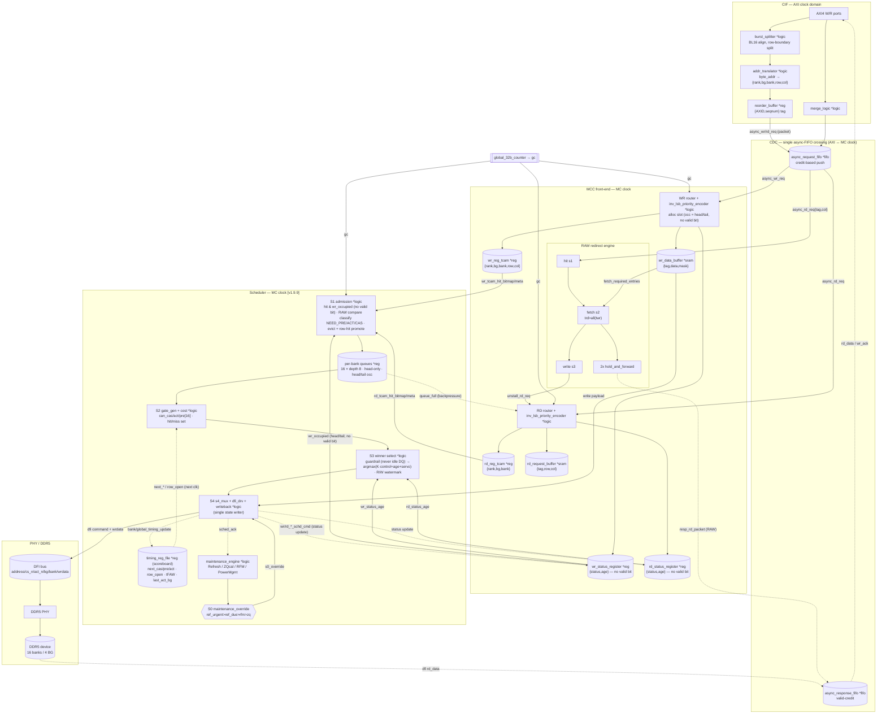

# RMC — Full Architecture (single mermaid, front-end + scheduler + PHY)

One stitched end-to-end diagram: **AXI/CIF → async-FIFO CDC → MCC front-end (buffers + RAW)
→ scheduler (S0–S4 + per-bank queues + weight arbiter) → DFI → PHY/DDR5**, plus the response
path back. Combines [`mcc_v3.1_diagram.md`](mcc_v3.1_diagram.md) and
[`scheduler_cmd_pipeline_detailed.md`](scheduler_cmd_pipeline_detailed.md) into one picture.
`[v1.9.9]`: no valid bit (occupancy = head/tail, RAW gate = `wr_occupied`), per-bank queues,
weight arbiter, row-hit promotion, never-idle-DQ guardrail.

Legend: `*fifo/*reg/*sram/*logic` = block type · solid = forward request/command/data ·
dashed = writeback / feedback / response.

---

## The path in one paragraph

AXI bursts are split to BL16, address-translated to `{rank,bg,bank,row,col}`, tagged in the
ROB, and pushed across the **single async-FIFO CDC** into the **MCC front-end**. There the
WR/RD routers allocate slots (occupancy = **head/tail pointers, no valid bit**), store address
in the `*_reg_tcam` reg arrays and payload in `wr_data_buffer`/`rd_request_buffer`; the **RAW
engine** serves any read whose data is still an in-flight write (`trd > all(twr)`) straight
back through the response FIFO. The front-end's right edge — TCAM hit bitmaps/meta,
`wr_occupied`, status `age`, `gc` — is the **scheduler's** Stage-1 input. The scheduler
classifies + evicts into **16 per-bank FIFOs** (row-hit promoted), hard-masks legality (S2),
picks a winner (S3: **guardrail never idles DQ**, else `argmax(K·control+age+servo)` with R/W
watermark batching), and emits the DDR5 command on **DFI** (S4), which the **single writeback**
uses to advance the `timing_reg_file` scoreboard, update MCC request status (`schd_cmd`), ack
the maintenance engine, and retire the queue entry. Read data returns via DFI → response FIFO
→ CIF → AXI. Stage 0 (maintenance: REF/ZQ/RFM/PM) pre-empts everything through `s4_mux`.

Individual zooms: [`README.md`](README.md) indexes every per-block diagram.
