# MCC Front-End — Block/Signal Diagram (mermaid recreation of `mcc_v3.1.vsdx`)

Mermaid transcription of the `mcc_v3.1` Visio drawing (the front-end request-buffer / RAW
block diagram) — every sub-block with its storage/logic type + `{fields}`, every wire with
its signal, the scheduler-interface exposed as right-edge pins. Two mirrored paths:
**WR request** (top), **RD request** (bottom), with the **RAW** redirect engine in the
middle and the async CIF↔MCC FIFOs on the left.

This is the block whose right edge feeds the scheduler — see
[`scheduler_cmd_pipeline_diagram.md`](scheduler_cmd_pipeline_diagram.md) /
[`scheduler_cmd_pipeline_detailed.md`](scheduler_cmd_pipeline_detailed.md) for what picks up
from here. Status registers annotated `[v1.9.9] no valid bit` (occupancy = head/tail; see the
repo-wide sweep) — structure otherwise faithful to the Visio source.

Legend: `*fifo` = FIFO · `*reg` = register file · `*sram` = SRAM · `*logic` = combinational ·
**▷ pin** = scheduler-interface port.

```mermaid
flowchart LR

  %% ==================== ASYNC CIF <-> MCC FIFOs ====================
  subgraph ASYNC["async buffers  (CIF ↔ MCC, the one CDC)"]
    direction TB
    WRP_FIFO[("write_request_path  *fifo<br/>WR_REQ_FIFO_DEPTH")]
    RDP_FIFO[("read_request_path  *fifo<br/>RD_REQ_FIFO_DEPTH")]
    RRES[("read_response_path  *fifo<br/>RD_RES_FIFO_DEPTH")]
    WRES[("write_response_path  *fifo<br/>WR_RES_FIFO_DEPTH")]
  end

  %% ==================== WR REQUEST PATH ====================
  subgraph WRPATH["WR request path"]
    direction TB
    WRTR["incoming cmd/req router  *logic<br/>(write side)"]
    WRENC{{"inv_lsb_priority_encoder"}}
    WRVAL[("write_valid_register  *reg  N_WR_ENTRIES x1<br/>{status, timestamp}<br/>[v1.9.9] no VALID bit — occ = head/tail")]
    WRTCAM[("wr_reg_tcam_reg_array  *reg  N_WR_ENTRIES x1<br/>{wr_rank, wr_bg, wr_bank, wr_row, wr_col}")]
    WRTS1["tcam_search_logic_1<br/>~refer wr_req_tcam.vsdx"]
    WRTS2["tcam_search_logic_2<br/>~refer wr_req_tcam.vsdx"]
    WRDATA[("wr_data_buffer  *sram  N_WR_ENTRIES x1<br/>{wr_tag, wr_data, wr_byte_mask}")]
  end

  %% ==================== RAW REDIRECT ENGINE ====================
  subgraph RAWENG["RAW redirect engine"]
    direction TB
    RAWH["RAW_hit  stage_1  *logic<br/>column overflow / fully_wrapped check"]
    RAWF["RAW_fetch  stage_2  *logic<br/>fetch write_data_buffer; verify time_stamps<br/>(trd_req &gt; all(twr_req)); packet formation"]
    RAWW["RAW_write  stage_3  *logic<br/>invalidate read_req / unstall_readreq"]
    HNF["2x hold_and_forward  *logic *sram<br/>hold raw packet if read_path busy"]
    RAWH -- "rd_req_raw_go/no_go" --> RAWF
    RAWF -- "raw_rd_packet" --> HNF
    RAWF --> RAWW
  end

  %% ==================== RD REQUEST PATH ====================
  subgraph RDPATH["RD request path"]
    direction TB
    RDTR["incoming cmd/req router  *logic<br/>(read side)"]
    RDENC{{"inv_lsb_priority_encoder"}}
    RDVAL[("rd_valid_register  *reg  N_RD_ENTRIES x1<br/>{rd_status, rd_timestamp}<br/>[v1.9.9] no RD_VALID bit — occ = head/tail")]
    RDTCAM[("rd_reg_tcam_reg_array  *reg  N_RD_ENTRIES x1<br/>{rd_rank, rd_bg, rd_bank}")]
    RDTS2["tcam_search_logic_2<br/>~refer rd_req_tcam.vsdx"]
    RDBUF[("rd_request_buffer  *sram  N_RD_ENTRIES x1<br/>{rd_tag, rd_row, rd_col}")]
  end

  %% ==================== SCHEDULER-INTERFACE PORTS (right edge) ====================
  subgraph PORTS["scheduler-interface ports  ▷"]
    direction TB
    GC1>"global_32b_counter"]
    P_WSCHD>"wr_invalidate/update_req_status_schd_cmd"]
    P_WFULL>"wr_reqs_full_flag"]
    P_WSTAT>"wr_status_rd / time_stamp_rd_data / _idx"]
    P_WVSR>"wr_valid_status_reg_rd"]
    P_WTC>"wr_reg_tcam_search_content / _mask / _hit_vector"]
    P_WRB>"wr_req_buffer_rd_idx_port_1 / _rd_data_port_1"]
    P_RSCHD>"rd_invalidate/update_status_schd_cmd"]
    P_RFULL>"rd_reqs_full_flag"]
    P_RSTAT>"rd_status_rd / time_stamp_rd_data / _idx"]
    P_RVSR>"rd_valid_status_reg_rd"]
    P_RTC>"rd_reg_tcam_rd_idx / _rd_data / _search_content / _mask / _hit_vector"]
    P_RRB>"rd_req_buffer_rd_idx_port_1/2 / _rd_port_1/2"]
  end

  %% ---------------- async FIFO <-> WR router ----------------
  WRTR -- "async_wr_req_ready" --> WRP_FIFO
  WRP_FIFO -- "async_wr_req_valid" --> WRTR
  WRP_FIFO -- "async_wr_req" --> WRTR
  GC1 -- "global_32b_counter" --> WRTR
  P_WSCHD -. "wr_invalidate/update_req_status_schd_cmd" .-> WRTR

  %% ---------------- WR allocator / valid reg ----------------
  WRENC -- "next_free_slot_idx / full_flag" --> WRTR
  WRVAL -- "valid_field" --> WRENC
  WRTR -- "index_ptr / capture_en" --> WRVAL
  WRTR -- "validate/invalidate, update status, timestamping path" --> WRVAL
  WRVAL --> P_WSTAT
  WRVAL --> P_WVSR
  WRTR --> P_WFULL

  %% ---------------- WR TCAM + data ----------------
  WRTR -- "async_wr_req_addr_s1" --> WRTCAM
  WRTCAM -- "reg_file_output_bus" --> WRTS2
  WRP_FIFO -- "async_rd_req_valid / async_rd_req" --> WRTS1
  WRTS1 <--> WRTS2
  WRTS2 --> P_WTC
  WRTS2 --> P_WRB
  WRTR -- "async_wr_req_data_s2" --> WRDATA
  WRDATA --> P_WRB

  %% ---------------- RAW engine wiring ----------------
  RDP_FIFO -- "async_rd_req_valid / async_rd_req{tag,column,..}" --> RAWH
  RAWH -- "wr_valid_hitmap_unmasked_column" --> WRTCAM
  RAWF -- "fetch_required_entries (req)" --> WRDATA
  WRDATA -- "wr_valid, time_stamp_fetch" --> RAWF
  HNF -- "read_packet_path_busy / read_packet_path" --> RAWF
  HNF -- "resp_rd_packet_valid / resp_rd_packet" --> RRES
  RAWW -- "raw_invalidate_reg_req / unstall_rd_req" --> RDTR

  %% ---------------- async FIFO <-> RD router ----------------
  RDTR -- "async_rd_req_ready" --> RDP_FIFO
  RDP_FIFO -- "async_rd_req_valid" --> RDTR
  GC1 -- "global_32b_counter" --> RDTR
  P_RSCHD -. "rd_invalidate/update_status_schd_cmd" .-> RDTR

  %% ---------------- RD allocator / valid reg ----------------
  RDENC -- "next_free_slot_idx / full_flag" --> RDTR
  RDVAL -- "valid_field" --> RDENC
  RDTR -- "index_ptr / capture_en" --> RDVAL
  RDTR -- "validate/invalidate, update status, timestamping path" --> RDVAL
  RDVAL --> P_RSTAT
  RDVAL --> P_RVSR
  RDTR --> P_RFULL

  %% ---------------- RD TCAM + buffer ----------------
  RDTR -- "async_rd_req_s1" --> RDTCAM
  RDTCAM -- "reg_file_output_bus" --> RDTS2
  RDTCAM --> P_RTC
  RDTS2 --> P_RRB
  RDTR -- "async_rd_req_s2" --> RDBUF
  RDBUF --> P_RRB
  RDTR -- "stall_rd_reg_if fully_wrapped (status=busy → scheduler ignores rd_req)" --> RDVAL
```

---

## Full-forms (acronym glossary)

| Term | Full form / meaning |
|---|---|
| **MCC** | Memory Controller Core (front-end request buffers + RAW engine) |
| **CIF** | Core InterFace — the AXI-side front block; CIF↔MCC cross the one async FIFO CDC |
| **CDC** | Clock-Domain Crossing (AXI clock ↔ MC clock), a single async-FIFO pair |
| **FIFO** | First-In First-Out queue (the async request/response paths) |
| **TCAM** | Ternary Content-Addressable Memory — address search reg array |
| **RAW** | Read-After-Write — a read whose data is still in a pending write |
| **HnF** | Hold-and-Forward — 2-deep buffer that holds a RAW packet if the read path is busy |
| **inv_lsb_priority_encoder** | inverted-LSB priority encoder → next free slot / full flag from the valid/occupancy field |
| **s1/s2/s3** | RAW stage 1 (hit/overflow check) / stage 2 (fetch+verify+packet) / stage 3 (invalidate/unstall) |
| **trd_req / twr_req** | read-request / write-request timestamps (RAW age check `trd_req > all(twr_req)`) |
| **schd_cmd** | scheduler command — invalidate/update-status writeback the scheduler sends back to MCC |
| **s1 / s2 (suffix)** | pipeline stage of the address (`_addr_s1`) vs data (`_data_s2`) capture |

---

## Flow (signal by signal)

1. **Intake (WR).** CIF pushes into `write_request_path` (async FIFO, credit-based). The
   `incoming cmd/req router` handshakes `async_wr_req_ready/valid/req`, timestamps with
   `global_32b_counter`, and allocates a slot via `inv_lsb_priority_encoder`
   (`next_free_slot_idx`/`full_flag` from the occupancy/`valid_field` — **[v1.9.9] head/tail
   pointers, no valid bit**).
2. **Store (WR).** The address `async_wr_req_addr_s1` lands in `wr_reg_tcam_reg_array`
   (`{wr_rank,wr_bg,wr_bank,wr_row,wr_col}`); the payload `async_wr_req_data_s2` lands in
   `wr_data_buffer` SRAM (`{wr_tag,wr_data,wr_byte_mask}`). `write_valid_register` holds
   `{status,timestamp}`. `tcam_search_logic_1/2` expose the search/hit interface.
3. **RAW check.** A read (`async_rd_req{tag,column}`) enters `RAW_hit s1` (column-overflow /
   fully-wrapped check) → `wr_valid_hitmap_unmasked_column` searches the WR TCAM. On a
   `rd_req_raw_go`, `RAW_fetch s2` pulls `fetch_required_entries` from `wr_data_buffer`,
   verifies `trd_req > all(twr_req)` (newest write wins), and forms `raw_rd_packet`.
4. **Forward / hold.** `2x hold_and_forward` sends `resp_rd_packet` to `read_response_path`;
   if that path is busy (`read_packet_path_busy`) it holds (2 deep). `RAW_write s3`
   invalidates the served read (`raw_invalidate_reg_req/unstall_rd_req`) back to the RD router.
5. **Intake/store (RD)** mirrors WR: `read_request_path` → `incoming cmd/req router` →
   `rd_reg_tcam_reg_array` (`{rd_rank,rd_bg,rd_bank}`) + `rd_request_buffer`
   (`{rd_tag,rd_row,rd_col}`). A `fully_wrapped` read is stalled (`status=busy`) so the
   scheduler ignores it for now.
6. **To the scheduler.** The right-edge pins (`*_reg_tcam_hit_vector`, `*_req_buffer_rd_data`,
   `*_status/time_stamp_rd_data`, `*_valid_status_reg_rd`, `*_reqs_full_flag`, `global_32b_counter`)
   are exactly the scheduler's Stage-1 inputs — the handoff boundary of
   [`scheduler_cmd_pipeline_detailed.md`](scheduler_cmd_pipeline_detailed.md).

Solid arrows = forward request/data. Dashed arrows = the `schd_cmd` writeback the scheduler
sends back into the routers.
