# RMC Datapath Architecture — Diagram

Companion diagram for [`docs/rmc_datapath_architecture.md`](../rmc_datapath_architecture.md).
Architecture/specification document — not RTL. See that document for the full explanation,
sourcing, and OPEN items; this page is the visual summary only.

Source figures: `docs/sched_rebuild/fig/fig_06_datapath.py`, `fig_mcc_block.py`,
`fig_05_packer.py`.

```mermaid
flowchart LR
    L3["L3 / Inter-Rank Arb\n(the only rank arbiter)"]
    PACKER["Phase Packer\ngear 1:4 bundle fill"]
    COMMIT{{"CAS Commit\n{op, tag, sram_addr}"}}
    L3 --> PACKER --> COMMIT

    WDSRAM[("WD_SRAM\nCIF-owned\n512b/line")]
    RDSRAM[("RD_SRAM\nCIF-owned\n512b/line")]

    subgraph DP["DATA PATH"]
        direction TB

        subgraph WRLANE["WRITE  ·  WD_SRAM -> DFI TX -> DRAM"]
            direction LR
            WL["WL_line\ndepth = CWL"]
            WDR["WD_SRAM read\n1 x 512b @ wd_slot"]
            SPLIT["write_burst_splitter\n512b -> serialize"]
            WDONE["wr_done\n(self-timed, no ack)"]
            WL -->|"fire @ slot 0\n(launch)"| WDR --> SPLIT --> WDONE
        end

        subgraph RDLANE["READ  ·  DRAM -> DFI RX -> RD_SRAM"]
            direction LR
            RL["RL_line\ndepth = CL"]
            ACC["read_accumulator\ndeserialize -> gather 64B"]
            RDW["RD_SRAM write\n1 x 512b @ dbuf_addr"]
            RDONE["rd_done\n(last beat committed)"]
            RL -->|"fire @ slot 0\n(launch)"| ACC --> RDW --> RDONE
        end
    end

    COMMIT -->|"if WR"| WL
    COMMIT -->|"if RD"| RL
    WDSRAM -. "read" .-> WDR
    RDW -. "write" .-> RDSRAM

    DFITX(["dfi_wrdata\n2xgear beats/mc_clk\n(1:4 -> 8 beats/mc_clk,\n2 mc_clk / BL16)"])
    DFIRX(["dfi_rddata\n2xgear beats/mc_clk\n(1:4 -> 8 beats/mc_clk,\n2 mc_clk / BL16)"])
    SPLIT --> DFITX
    DFIRX --> ACC

    PHY["DFI / PHY"]
    DRAM[("DDR5 DRAM")]
    DFITX --> PHY --> DRAM
    DRAM --> PHY --> DFIRX

    COMPLETION["COMPLETION\nrd_done | wr_done"]
    WDONE --> COMPLETION
    RDONE --> COMPLETION
    CIFRESP["-> CIF (async resp FIFO)\n{tag=rob_index, status}"]
    COMPLETION --> CIFRESP

    classDef sram fill:#e8e2f5,stroke:#7a5cb8,stroke-width:1.4px;
    classDef ext fill:#f4f4f4,stroke:#888,stroke-width:1.2px;
    classDef commit fill:#fff3cd,stroke:#b8860b,stroke-width:1.4px;
    classDef wr fill:#e4f0ff,stroke:#2b6cb0,stroke-width:1.2px;
    classDef rd fill:#e6f7e9,stroke:#2f8a4e,stroke-width:1.2px;
    class WDSRAM,RDSRAM sram;
    class PHY,DRAM,CIFRESP ext;
    class COMMIT commit;
    class WL,WDR,SPLIT,WDONE wr;
    class RL,ACC,RDW,RDONE rd;
```

**Reading the diagram:**

- `WD_SRAM` / `RD_SRAM` are drawn as cylinders **outside** the `DATA PATH` box deliberately —
  they are **CIF-owned** external memories, not MCC-local buffers. The datapath only ever
  performs one 512-bit access to each, per packet. (`WD_SRAM`'s exact cross-domain/port
  implementation is not documented the way `RD_SRAM`'s "dual-domain" form is — OPEN, see the
  main document §4.1/§12.1.)
- The two lanes are drawn with an unambiguous direction each: **WRITE** flows
  `WD_SRAM → splitter → dfi_wrdata → DRAM`; **READ** flows
  `DRAM → dfi_rddata → accumulator → RD_SRAM`. They share no state except the `COMPLETION`
  block.
- `2×gear` labels the DFI-side beat rate; at gear **1:4** that is 8 beats of 32-bit DQ data per
  `mc_clk`, so one 512-bit (BL16) line takes 2 `mc_clk` cycles to serialize/deserialize. See
  §4.2/§5.3 of the main document for the derivation — the exact bit/beat-to-phase ordering is
  OPEN (§12.1).
- `wr_done` is self-timed (no DRAM/PHY acknowledgment); `rd_done` fires when the last beat has
  been committed into `RD_SRAM`. Both converge on a shared `COMPLETION` block before crossing
  back to CIF asynchronously.
