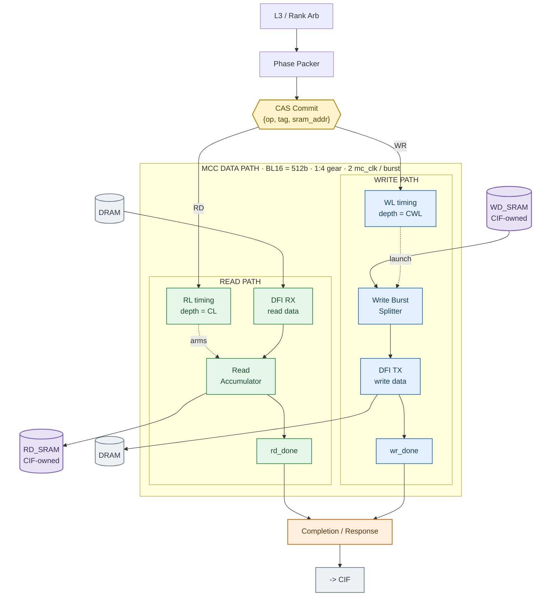

# RMC Datapath Architecture — Diagram

Visual summary of the datapath architecture defined in
[`docs/rmc_datapath_architecture.md`](../rmc_datapath_architecture.md); read that document for
the full explanation, sourcing, and OPEN items.

Source figures: `docs/sched_rebuild/fig/fig_06_datapath.py`, `fig_mcc_block.py`,
`fig_05_packer.py`.

