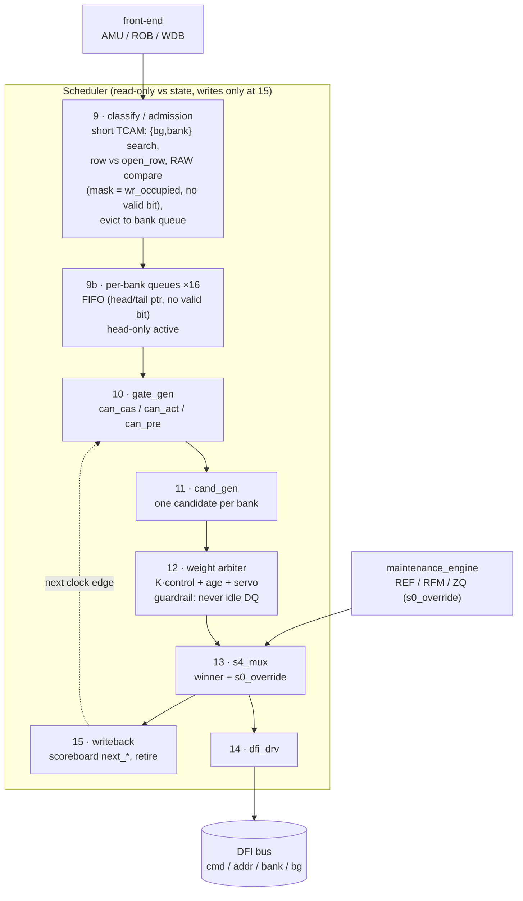
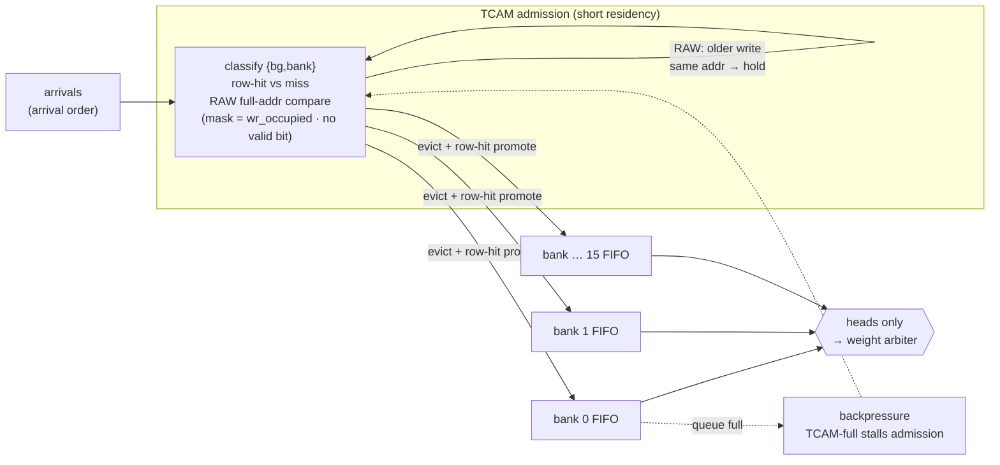
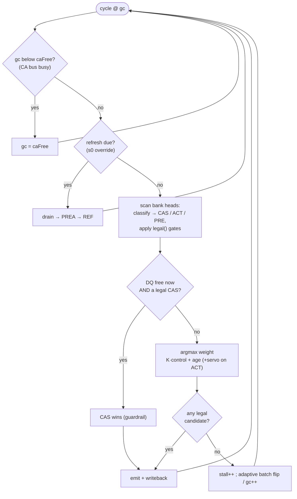

# RMC Scheduler — Block Diagrams

GitHub-native (Mermaid) block diagrams of the scheduler the golden model
[`../tools/sched_model/sched_test.js`](../tools/sched_model/sched_test.js) implements.
Authoritative wiring: [`../short_notes/scheduler_deep.md`](../short_notes/scheduler_deep.md) §7;
residency split: [`scheduler_queue_arch.md`](scheduler_queue_arch.md).

---

## 1. Scheduler dataflow (blocks 9–15, the closed loop)



Loop: writeback updates the scoreboard, next edge feeds `gate_gen`, arbiter picks, writeback
commits. The maintenance engine injects refresh/RFM/ZQ through the same `s4_mux` — no third
command path.

---

## 2. Residency split — admission → per-bank queues → heads

The post-mentor rework: TCAM is a **short classify station**, not a lifetime home. Classified
requests **evict** into per-bank FIFOs; only the **head** of each bank competes. On
eviction a row-hit is **promoted** next to its same-row siblings (insert after the last
same-row entry, not the tail) so it isn't stranded behind a same-bank miss — reorders only
across *different* rows (no hazard); same-row order preserved.



Timers (`next_cas/pre/act`) are **per-bank scoreboard** properties the head reads — not
per-entry. Occupancy = per-bank **head/tail pointers + depth counter** = the relocated
watermark. **No per-entry `valid` bit** (mentor) — the pointers already say which slots are
live (head..tail occupied, rest empty by construction).

---

## 3. Per-cycle decision (the arbiter pick)



---

## Rendering

GitHub, GitLab, VS Code (with Mermaid preview), and Obsidian all render ```mermaid fences
natively — no image export, no Excalidraw round-trip. Edit the fence text and the diagram
updates. The existing `.excalidraw` / `.png` diagrams (referenced from `scheduler_deep.md`)
stay as the hand-drawn detail views; these are the always-current, diff-able block views.
