# RMC Scheduler — Detailed Block/Signal Diagram (mcc_v3.1 style)

Companion to `mcc_v3.1` (the front-end request-buffer / RAW block drawing). This is the same
level of detail — **every sub-block named with its storage/logic type, every wire labelled
with its signal, every external port drawn as a right-edge pin** — but for the **scheduler**:
the 5-stage command pipe from the MCC handoff to DFI command emission.

All internal nets are `[v1.9.9]` (residency split, per-bank queues, weight arbiter, row-hit
promotion, never-idle-DQ guardrail, **no valid bit** — occupancy = FIFO head/tail, RAW gate =
`wr_occupied`). External port names/widths are the frozen `RMC_IO_Map.md §19` ports. Renders
inline on GitHub. Golden reference: [`../tools/sched_model/sched_test.js`](../tools/sched_model/sched_test.js).

Legend: `*logic` = combinational block · `*reg` = register file · `*sram` = SRAM ·
`*fifo` = FIFO · **▷ pin** = external port · ◆ = decision. Solid = forward command/data,
dashed = writeback / feedback (closes next clock edge).

```mermaid
flowchart TB

  %% ==================== MCC HANDOFF BOUNDARY (right edge of mcc_v3.1) ====================
  subgraph MCC["MCC front-end handoff  (left edge = right edge of mcc_v3.1)"]
    direction TB
    WRBUF[("wr_data_buffer  *sram  N_WR_ENTRIES x1<br/>{wr_tag, wr_data, wr_byte_mask}")]
    RDBUF[("rd_request_buffer  *sram  N_RD_ENTRIES x1<br/>{rd_tag, rd_row, rd_col}")]
    WRTCAM[("wr_reg_tcam_reg_array  *reg  N_WR_ENTRIES<br/>{wr_rank, wr_bg, wr_bank, wr_row, wr_col}")]
    RDTCAM[("rd_reg_tcam_reg_array  *reg  N_RD_ENTRIES<br/>{rd_rank, rd_bg, rd_bank}")]
    STAT[("wr/rd_status_register  *reg<br/>{status→queue, age, work_state}<br/>[v1.9.9] NO valid bit — occ = head/tail")]
    GC[["global_32b_counter  →  gc"]]
  end

  %% ==================== STAGE 0 — MAINTENANCE OVERRIDE (beside the pipe) ====================
  subgraph S0["STAGE 0 — Maintenance Override  *logic"]
    direction TB
    MEIN["maintenance_engine inputs<br/>ref_urgent / ref_due / rfm_req[rank] / zq_due<br/>global_state"]
    S0MUX{{"s0_priority_mux<br/>ref_urgent &gt; ref_due &gt; rfm &gt; zq"}}
    MEIN -- "req lines" --> S0MUX
  end

  %% ==================== STAGE 1 — TCAM SEARCH / ADMISSION ====================
  subgraph S1["STAGE 1 — TCAM Search / Admission  *logic"]
    direction TB
    HITGEN["hit_bitmap_gate  *logic<br/>RAW hit &amp; wr_occupied → s1_hit_bitmap[N_BANKS]<br/>(no valid bit; RD pre-filter retired)"]
    RAW{{"raw_compare  *BCAM (full addr)<br/>older write to same addr in flight?<br/>match masked by wr_occupied"}}
    CLS["classify  *logic<br/>row vs open_row → NEED_PRE / NEED_ACT / NEED_CAS"]
    EVI["s1_evict  *logic<br/>classified + RAW-clear → bank queue<br/>row-hit promotion (FR-FCFS)"]
    HITGEN -- "s1_hit_meta{row,col,req_type,entry_idx,axi_id}" --> RAW
    RAW -- "raw_block_en (hold, NOT evicted)" --> HITGEN
    RAW -- "raw_clear" --> CLS
    CLS -- "work_state{NEED_*}" --> EVI
  end

  %% ==================== PER-BANK IN-FLIGHT QUEUES [v1.9.9] ====================
  subgraph QUE["PER-BANK IN-FLIGHT QUEUES  *reg  [v1.9.9]"]
    direction TB
    BQ[("bank_queue_fifo  *reg  16 × depth BANK_DEPTH(8)<br/>entry {rw, seqnum, bg, bank, row, col, state[2], blocked}<br/>arrival order · head-only active · NO valid bit")]
    PRO["row_hit_promote  *logic<br/>insert after last same-row entry"]
    HEAD["queue_head[N_BANKS]  *logic<br/>{can_pre / can_act / can_cas ready-bit per bank}"]
    DEP["occupancy  *logic<br/>head/tail pointers + queue_depth[N_BANKS] + full flag<br/>= relocated watermark (no valid bit)"]
    PRO --> BQ
    BQ --> HEAD
    BQ --> DEP
  end

  %% ==================== STAGE 2 — can_* GATE + COST CLASSIFY ====================
  subgraph S2["STAGE 2 — Legality Gate + Cost Classify  *logic"]
    direction TB
    GATE["gate_gen · legal()  *logic<br/>can_cas / can_act / can_pre [N_BANKS] (hard mask)<br/>can_cas_any / can_act_any / can_faw / can_rd_wr / can_wr_rd"]
    COST["cost_classify  *logic<br/>hit_set_bitmap / miss_set_bitmap<br/>remaining_cost[bank]"]
    GATE --> COST
  end

  %% ==================== STAGE 3 — WINNER SELECT (weight arbiter) ====================
  subgraph S3["STAGE 3 — Winner Select · Weight Arbiter  *logic  [v1.9.9]"]
    direction TB
    GRD{"guardrail  ◆<br/>DQ free now AND legal CAS ready?"}
    ARB["weight_arbiter  *logic<br/>argmax( K·control + age + servo_mod )<br/>control: CAS=2 / ACT=1 / PRE=0"]
    WM["watermark_bias  *logic<br/>wr_count / wr_high_wm_hit / wr_low_wm_hit<br/>→ R/W batch direction"]
    GRD -- "yes: guardrail CAS (never idle DQ)" --> WIN["winner_latch  *reg"]
    GRD -- "no" --> ARB
    WM --> ARB
    ARB -- "argmax winner" --> WIN
  end

  %% ==================== STAGE 4 — EMISSION + WRITEBACK ====================
  subgraph S4["STAGE 4 — Command Emission + Writeback  *logic"]
    direction TB
    S4MUX{{"s4_mux<br/>s0_override ? maint : winner"}}
    DRV["dfi_drv  *logic<br/>encode DDR5 command"]
    WB["writeback  *logic  (the ONLY state writer)<br/>bank_fsm_update / global_timing_update<br/>status_update / raa_inc / sched_ack / retire"]
    S4MUX --> DRV
    S4MUX --> WB
  end

  %% ==================== SCOREBOARD (timing reg file) ====================
  TRF[("timing_reg_file  *reg  (scoreboard)<br/>next_cas / next_pre / next_act · row_open · state<br/>tFAW ring · nRdWr / nWrRd · last_act_bg")]

  %% ==================== EXTERNAL OUTPUT PORTS (right-edge pins) ====================
  subgraph PORTS["EXTERNAL PORTS  ▷"]
    direction TB
    P_ADDR>"dfi_address"]
    P_CS>"dfi_cs_n"]
    P_ACT>"dfi_act_n"]
    P_BGBK>"dfi_bg / dfi_bank"]
    P_WR>"dfi_wrdata / _en / _mask"]
    P_CV>"dfi_cmd_valid"]
    P_WRB>"wr_invalidate/update_req_status_schd_cmd → MCC"]
    P_RDB>"rd_invalidate/update_status_schd_cmd → MCC"]
    P_ACK>"sched_ack → Maintenance Engine"]
    P_RAA>"raa_inc_en → Per-Rank FSM"]
    P_FULL>"queue_full[N_BANKS] → MCC (backpressure)"]
  end

  %% ---------------- MCC → Stage 1 ----------------
  WRTCAM -- "wr_tcam_hit_bitmap[N_WR] / wr_tcam_hit_meta" --> HITGEN
  RDTCAM -- "rd_tcam_hit_bitmap[N_RD] / rd_tcam_hit_meta" --> HITGEN
  STAT   -- "wr_occupied[N_WR] (head/tail · no valid bit)" --> HITGEN
  STAT   -- "wr_status_age / rd_status_age" --> ARB
  WRBUF  -- "raw_search_key / fetch_required_entries" --> RAW
  GC     -- "gc" --> HITGEN

  %% ---------------- Stage 1 → queues ----------------
  EVI -- "s1_evict_en / _bank / _entry (§9E)" --> PRO
  DEP -- "queue_full[N_BANKS] (backpressure)" --> RDBUF
  DEP -- "queue_full[N_BANKS]" --> P_FULL
  HITGEN -- "tcam_full (admission stall)" --> RDBUF

  %% ---------------- queues → Stage 2 ----------------
  HEAD -- "s1_hit_bitmap / s1_hit_meta[] (16 heads only)" --> GATE
  DEP  -- "queue_depth (age term)" --> ARB
  TRF  -- "next_cas/pre/act_out · state_out · row_open_out" --> GATE
  GC   -- "gc" --> GATE

  %% ---------------- Stage 2 → Stage 3 ----------------
  COST -- "hit_set_bitmap / miss_set_bitmap / remaining_cost[]" --> GRD
  COST -- "candidate set" --> ARB
  TRF  -- "last_act_bg_out (BG rotation)" --> ARB
  GATE -- "can_rd_wr / can_wr_rd" --> WM
  GC   -- "gc (age)" --> ARB

  %% ---------------- Stage 3 → Stage 4 ----------------
  WIN -- "winner_valid / winner_cmd_type<br/>winner_rank/bg/bank/row/col / winner_entry_idx / winner_req_type" --> S4MUX
  S0MUX -- "s0_override / s0_cmd_type / s0_rank/bg/bank" --> S4MUX

  %% ---------------- Stage 4 → DFI emission ----------------
  WRBUF -- "wr_req_buffer_rd_data (write payload)" --> DRV
  TRF   -- "timing_reg_vals (parallel)" --> DRV
  DRV --> P_ADDR
  DRV --> P_CS
  DRV --> P_ACT
  DRV --> P_BGBK
  DRV --> P_WR
  DRV --> P_CV

  %% ---------------- writeback loop + acks ----------------
  WB -. "bank_fsm_update_* / global_timing_update_*" .-> TRF
  TRF -. "next clock edge → Stage 2" .-> GATE
  WB -. "status_update_en/idx/val" .-> STAT
  WB -. "retire / dequeue" .-> BQ
  WB -. "wr_*_schd_cmd" .-> P_WRB
  WB -. "rd_*_schd_cmd" .-> P_RDB
  WB -. "sched_ack" .-> P_ACK
  WB -. "raa_inc_en" .-> P_RAA
```

---

## Full-forms (acronym glossary)

| Term | Full form / meaning |
|---|---|
| **MCC** | Memory Controller Core — the front-end request buffers (`mcc_v3.1`) that hand off to the scheduler |
| **TCAM** | Ternary Content-Addressable Memory — CAM with don't-care bits; here the `{BG,bank}` classify search |
| **BCAM** | Binary CAM — exact-match CAM; the RAW full-address compare |
| **RAW** | Read-After-Write hazard — a read to an address with an older pending write |
| **CAS** | Column Address Strobe — the READ/WRITE column command (the one that moves data on DQ) |
| **ACT** | Activate — open a row into the bank's sense amps |
| **PRE** | Precharge — close the open row |
| **REF / REFab / REFsb** | Refresh / all-bank refresh / same-bank refresh |
| **RFM** | Refresh Management (JEDEC) — extra refresh forced by the RAA counter |
| **ZQ** | ZQ calibration — output-driver / ODT impedance calibration |
| **RAA** | Rolling Accumulated ACT — per-bank activate counter that triggers RFM |
| **DQ** | Data bus — carries the burst payload (resource we maximise occupancy of) |
| **CA** | Command/Address bus — carries one DDR5 command per 2 tCK |
| **DFI** | DDR PHY Interface — the MC↔PHY boundary (address/cs/act/bg/bank/wrdata) |
| **FIFO** | First-In First-Out queue |
| **FR-FCFS** | First-Ready, First-Come-First-Served — the open-page reorder policy (row-hit promotion) |
| **BG / BL** | Bank Group / Burst Length (BL16 here) |
| **SJF** | Shortest-Job-First (the earlier cost heuristic; superseded by the weight arbiter) |
| **gc** | global cycle counter (32-bit free-running time base) |
| **N** | DFI gear ratio = DRAM clock / controller clock (1:2 → N=2, 1:4 → N=4) |
| **tCK** | one DRAM clock period |
| **tRCD / tRP / tRAS** | ACT→CAS / PRE→ACT / ACT→PRE minimum delays |
| **tCCD_S / tCCD_L** | CAS→CAS delay, different-BG (8=BL/2, gapless) / same-BG (12, bubble) |
| **tFAW** | Four-Activate Window — ≤4 ACT per 32 tCK (binding prep ceiling) |
| **tRTP / tWR / tWTR** | read→PRE / write-recovery / write→read delays |
| **RL / WL** | Read Latency / Write Latency (CAS→data on DQ) |

---

## Signal dictionary (all wires on the diagram)

| Signal | Width | Producer → Consumer | Meaning |
|---|---|---|---|
| `wr_tcam_hit_bitmap` / `_meta` | N_WR_ENTRIES | WR_TCAM → S1 hit gate | per-entry row-hit + `{row,col,req_type,entry_idx,axi_id}` |
| `rd_tcam_hit_bitmap` / `_meta` | N_RD_ENTRIES | RD_TCAM → S1 hit gate | same, read side |
| `wr_occupied` | N_WR_ENTRIES | status reg → S1 / RAW | **[v1.9.9]** write-buffer head/tail range — masks RAW match. **No valid bit** |
| `wr_status_age` / `rd_status_age` | GC_WIDTH | status reg → arbiter | allocation timestamp (age term / tie-break) |
| `gc` | GC_WIDTH | global counter → S1/S2/S3 | free-running time base |
| `raw_block_en` | 1 | RAW → hit gate | read held at admission (pause, not evicted) |
| `s1_hit_bitmap` / `s1_hit_meta[]` | N_BANKS | S1 → S2 gate | classified candidate per bank (from queue heads) |
| `work_state` | 2 | classify → queue entry | NEED_PRE / NEED_ACT / NEED_CAS / DONE |
| `s1_evict_en/_bank/_entry` | — | S1 → queue | drop classified entry into per-bank FIFO |
| `tcam_full` | 1 | S1 → MCC | admission stall (backpressure) |
| `queue_head[N_BANKS]` | 16 × 3 | queue → S2 | per-bank `{can_pre,can_act,can_cas}` ready bits (head only) |
| `queue_depth[N_BANKS]` / `queue_full` | 16 | queue → S3 / MCC | pointer-delta occupancy (age term + backpressure). **No valid bit** |
| `can_cas/can_act/can_pre` | N_BANKS | S2 gate → S3 | hard legality mask |
| `can_cas_any / can_faw / can_rd_wr / can_wr_rd` | 1 | S2 → S3 | global legality flags |
| `hit_set_bitmap / miss_set_bitmap / remaining_cost[]` | — | S2 cost → S3 | row-hit vs miss split + per-bank cost |
| `next_cas/next_pre/next_act` | — | TRF → S2 | absolute-deadline timers (compare vs gc) |
| `row_open / state / last_act_bg` | — | TRF → S2/S3 | open-row, bank FSM state, BG-rotation hint |
| `weight` | — | S3 | `K·control + age + servo_mod`; control CAS=2/ACT=1/PRE=0 |
| `wr_count / wr_high_wm_hit / wr_low_wm_hit` | — | watermark → S3 | R/W batch-direction bias |
| `winner_valid / _cmd_type / _rank/_bg/_bank/_row/_col / _entry_idx / _req_type` | — | S3 → S4 | selected command |
| `s0_override / s0_cmd_type / s0_rank/_bg/_bank` | — | S0 → S4 | maintenance pre-emption |
| `dfi_address / _cs_n / _act_n / _bg / _bank / _wrdata(_en/_mask) / _cmd_valid` | per DFI | S4 drv → PHY | encoded DDR5 command on DFI |
| `bank_fsm_update_* / global_timing_update_*` | — | S4 WB → TRF | advance scoreboard (next clock) |
| `status_update_en/idx/val` | — | S4 WB → MCC status | mark request issued/done |
| `wr_*_schd_cmd / rd_*_schd_cmd` | — | S4 WB → MCC | invalidate/update req status |
| `raa_inc_en` | 1 | S4 WB → Per-Rank FSM | bump RAA on each ACT |
| `sched_ack` | 1 | S4 WB → Maint Engine | maintenance command consumed |

---

## Flow (signal by signal)

1. **Handoff.** The `MCC` box is the right edge of `mcc_v3.1`: `wr_data_buffer`/`rd_request_buffer`
   (SRAM), the two `*_reg_tcam_reg_array`s, the `status_register` (**now `{status→queue, age,
   work_state}` — no valid bit**, occupancy is head/tail), and `global_32b_counter` (`gc`).
2. **Stage 0** sits beside the pipe. `s0_priority_mux` ranks `ref_urgent > ref_due > rfm > zq`;
   if any fires it raises `s0_override` and its command reaches DFI **only** through `s4_mux`.
3. **Stage 1 admission.** `hit_bitmap_gate` ANDs the RAW TCAM hit with **`wr_occupied`** (write-buffer
   head/tail range — **no valid bit**; the RD bank pre-filter is retired, candidates are the queue
   heads) → `s1_hit_bitmap` + `s1_hit_meta`. `raw_compare` (BCAM, full address) resolves RAW once:
   a hit raises `raw_block_en` (the read is **held**, not evicted). `classify` tags
   `NEED_PRE/ACT/CAS`; `s1_evict` drops the entry into its bank FIFO — a **row-hit is promoted**
   next to its same-row siblings (FR-FCFS). `tcam_full`/`queue_full` are the only backpressure.
4. **Per-bank queues [v1.9.9].** 16 FIFOs, depth 8, **head-only active**, entry
   `{rw, seqnum, bg, bank, row, col, state[2], blocked}` — **no valid bit**. Occupancy is the
   `head/tail pointers + queue_depth[N_BANKS] + full flag` (relocated watermark). Only the 16
   `queue_head`s compete — not a flat CAM bitmap.
5. **Stage 2 legality.** `gate_gen · legal()` hard-masks `can_cas/act/pre[16]` against the
   `timing_reg_file` (`next_*`, `row_open`, `state`) and `gc`; `cost_classify` splits
   `hit_set`/`miss_set` and a per-bank `remaining_cost`. No subtractor in the emit path.
6. **Stage 3 winner.** `guardrail` first — **never idle DQ**: DQ free + a legal CAS ⇒ that CAS
   wins outright. Else `weight_arbiter` picks `argmax(K·control + age + servo_mod)` over legal
   candidates (`control` CAS=2/ACT=1/PRE=0), with `watermark_bias` steering R/W batch direction.
   Result latches into `winner_*`.
7. **Stage 4 emission + writeback.** `s4_mux` selects `s0_override ? maint : winner`; `dfi_drv`
   encodes the DDR5 command onto DFI (`dfi_address/cs_n/act_n/bg/bank/wrdata*`, `dfi_cmd_valid`),
   pulling the write payload from `wr_data_buffer`. `writeback` is the **single state writer**:
   it advances `timing_reg_file` (`bank_fsm_update`, `global_timing_update`), writes request
   status back to MCC (`status_update`, `*_schd_cmd`), bumps RAA (`raa_inc_en`), acks the
   maintenance engine (`sched_ack`), and retires/dequeues the queue entry. The next clock edge
   feeds `timing_reg_file` back into Stage 2 — that is the scheduler loop.

Solid arrows = forward command/data toward emission. Dashed arrows = the writeback/feedback
edges (state update, status writeback, acks, retire) that close on the next clock.

Companion drawings: overview [`scheduler_full_diagram.md`](scheduler_full_diagram.md) ·
per-stage zoom [`scheduler_stage_details.md`](scheduler_stage_details.md) ·
handoff-to-DFI [`scheduler_cmd_pipeline_diagram.md`](scheduler_cmd_pipeline_diagram.md).
