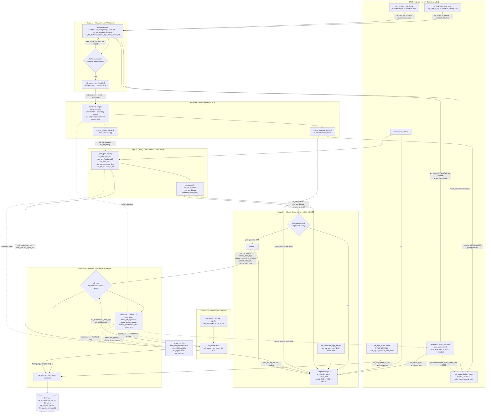

# RMC Scheduler — Detailed Command Pipeline (MCC handoff → DFI emission)

Companion to `mcc_v3.1` (the front-end request-buffer / RAW block diagram). That drawing
stops where the request buffers expose their **scheduler interface**: the timestamped req
arrays (**no valid bit** [v1.9.9] — occupancy is head/tail), the TCAM hit vectors, the read-port pairs, and the
`*_invalidate/update_status_schd_cmd` writeback ports. **This** diagram picks up exactly
there and runs the 5-stage scheduler all the way to **command (CM) emission on DFI**.

Signal names on the wires are the frozen external ports from `RMC_IO_Map.md §19` (Stage 0–4),
annotated with the `[v1.9.9]` internal-rework nets (per-bank queues, weight arbiter,
row-hit promotion, never-idle-DQ guardrail, no valid bit). Renders inline on GitHub. Golden reference:
[`../tools/sched_model/sched_test.js`](../../tools/sched_model/sched_test.js). Per-stage zoom
views (S0–S4, net level): [`scheduler_stage_details.md`](scheduler_stage_details.md).
Stitched overview: [`scheduler_full_diagram.md`](scheduler_full_diagram.md).

## Reading it

- **Boundary (top).** Everything in the `MCC` box is the right-hand edge of `mcc_v3.1`:
  the read/write buffers, the two TCAM reg arrays, the status/age registers (no valid bit),
  and `global_32b_counter` (= `gc`). The scheduler consumes hit vectors + `wr_occupied` + gc
  (**no valid bit** [v1.9.9]) and returns `*_schd_cmd` invalidate/update writes — no second
  command path back to MCC.
- **Stage 0** sits *beside* the pipe, not in it: it only reaches DFI through `s4_mux`
  (`s0_override`). Priority `ref_urgent > ref_due > rfm > zq`.
- **Stage 1** masks the RAW TCAM hit with `wr_occupied` (write-buffer head/tail range,
  **no valid bit** [v1.9.9]; the RD bank pre-filter is retired — candidates are the queue
  heads), resolves RAW once at admission (held reads
  raise `raw_block_en`, they are **not** evicted), then `s1_evict` drops the classified
  entry into its **per-bank FIFO**. `queue_full` / `tcam_full` are the only backpressure.
- **Per-bank queues [v1.9.9]** are the real reorder surface: 16 FIFOs, head-only active,
  row-hit promotion on eviction (FR-FCFS open-page). Only the 16 `queue_head`s compete —
  not the flat TCAM bitmap.
- **Stage 2** hard-masks legality (`can_*`) and splits `hit_set` / `miss_set` with a
  `remaining_cost` per bank. No subtractor in the emit path — timing is precomputed in
  `timing_reg_file`.
- **Stage 3** picks the winner. Guardrail first (**never idle DQ**: DQ free + legal CAS ⇒
  CAS wins), else `argmax(K·control + age + servo_mod)`. Watermarks bias R/W batching.
- **Stage 4** muxes maintenance vs winner, encodes the DDR5 command onto DFI, and runs the
  **single** writeback: it advances `timing_reg_file`, writes req status back to MCC,
  acks the maintenance engine, bumps RAA, and retires the queue entry. The next clock edge
  feeds `timing_reg_file` back into Stage 2 — that is the scheduler loop.

Solid arrows = command/data flow forward to emission. Dashed arrows = the writeback /
feedback edges (state update, status writeback, acks) that close on the next clock.
