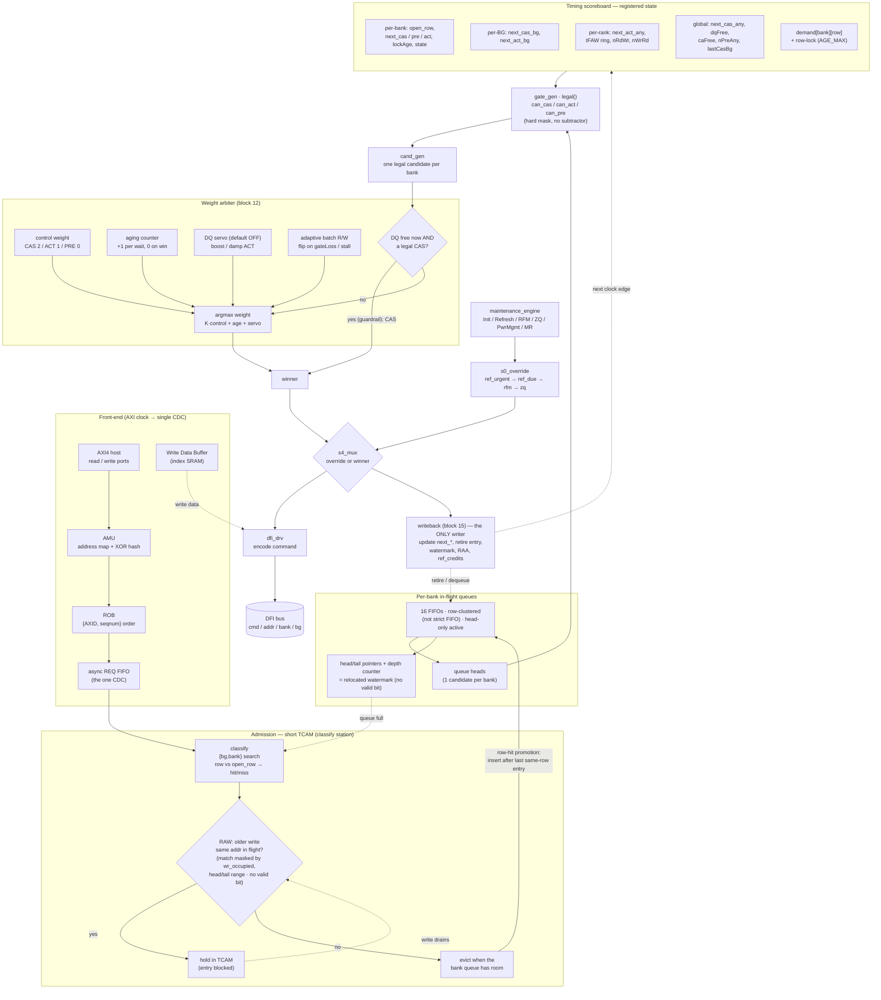

# RMC Scheduler — Full Stitched Block Diagram

One Mermaid diagram of the whole scheduler the golden model
[`../tools/sched_model/sched_test.js`](../tools/sched_model/sched_test.js) implements:
front-end → admission → per-bank queues → gates → weight arbiter → emit → DFI, with the
timing-scoreboard feedback loop and the maintenance-engine override. Renders inline on
GitHub. Detail views: [`scheduler_block_diagram.md`](scheduler_block_diagram.md) (per-stage),
[`../short_notes/scheduler_deep.md`](../short_notes/scheduler_deep.md) §7 (net list).

**The loop:** `writeback` is the single state writer — it advances the scoreboard, which the
next clock edge feeds back into `gate_gen`; the arbiter picks; `writeback` commits. The
maintenance engine reaches the DFI bus only through `s4_mux` (`s0_override`), never a second
command path. TCAM classifies then evicts (short residency); on eviction a row-hit is
**promoted** next to its same-row siblings (insert after the last same-row entry) so it
isn't stranded behind a same-bank miss; only bank heads compete; RAW is
resolved once at admission.
