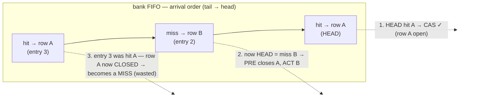
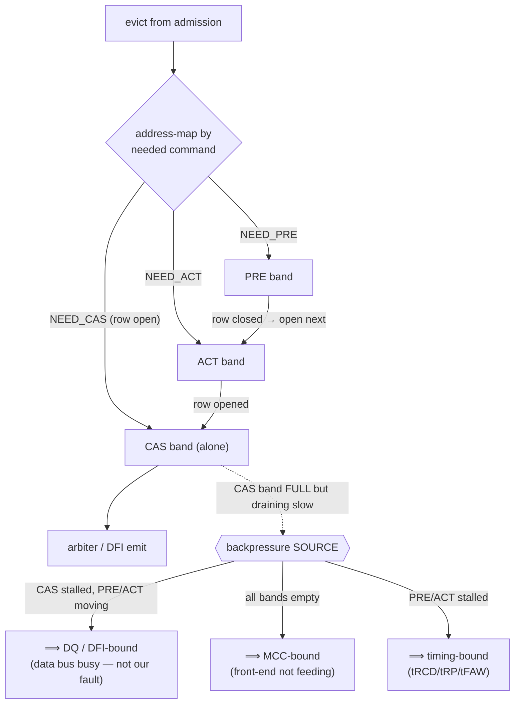
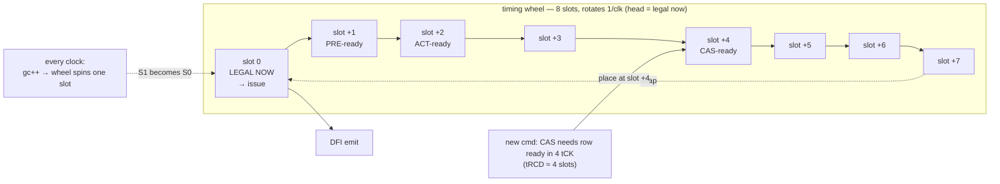

# Scheduler Queue — Design Exploration (head-of-line, band-split, spin-around wheel)

**Status: EXPLORATION / thinking-aid — not a locked spec.** Captures three ideas about the
per-bank queue so we can look at them and decide. The current design (per-bank FIFO + row-hit
promotion) is in [`scheduler_queue_arch.md`](../scheduler_queue_arch.md); this file is the
scratchpad for the "split the FIFO / spin-around buffer" idea.

---

## 1. The problem — per-bank FIFO holds back later row-hits

A per-bank FIFO is arrival-ordered. If a **row-miss** lands between two **row-hits to the
same row**, the second hit is stranded: servicing the miss **closes the row the later hit
needed**, so that hit turns into a fresh miss (wasted ACT/PRE).

**Row-hit promotion** (current fix) clusters same-row entries on eviction, so the FIFO becomes
`hit A, hit A, miss B` — both hits drain before the row closes. That solves *same-bank,
same-row* stalls. The ideas below are alternative structures.

---

## 2. Idea A — split the FIFO into PRE / ACT / CAS bands (same buffer, different address map)

One physical buffer, three logical **sub-spaces by command class**. An entry sits in the band
of the command it needs next. A **CAS-only band** gives a clean backpressure signal.

**Why the CAS-alone band is the useful part:** when CAS backs up while PRE/ACT keep moving,
you *know* the stall is the **DQ bus (DFI)**, not the MCC front-end and not bank timing. That
tells the batcher/servo the bottleneck without guessing.

**Risk (why we rejected a hard per-command split before):** a command's class is *live* — a
row-hit becomes a miss the instant another bank-mate closes the row. A hard band means
**migration** between bands on every row event, a **relocated CAM** to find entries, and
**rigid depth** (how many PRE vs CAS slots?). The band-map has to be a *view* over one buffer,
not physical partitions.

---

## 3. Idea B — spin-around ring = a TIMING WHEEL (place by ready-time)

The "spin-around, 8 deep, 4 mapped, slot 0-1 PRE / 2-3 ACT / 4-5 CAS, roles rotate each spin"
idea is a **timing wheel** (a.k.a. calendar queue): **slot position = the cycle the command
becomes legal.** The wheel rotates one slot per cycle; whatever lands at the **head is legal
NOW**. You don't FIFO-order by arrival — you place by *time*, which sidesteps head-of-line.

**How it handles your CAS example:** a CAS whose row opens in 4 cycles is dropped at **slot +4**.
Four spins later that slot is the head — the CAS is legal exactly when you read it. No polling,
no "is it ready yet"; the *position* is the readiness. The PRE/ACT/CAS "bands" are just the
natural latency ordering (PRE soon, ACT a bit later, CAS after tRCD) — and they "rotate"
because the wheel spins, not because you re-assign roles.

**What's genuinely good here:**
- Ordering is by **ready-time**, so a later same-row hit is not stuck behind an earlier miss —
  each sits at its own legal-time slot.
- The head is *always* legal ⇒ no per-cycle legality scan of the whole queue.

**What needs care (the confusing bits):**
- **Delay > wheel depth** (tRAS, tRFC ≫ 8): needs an overflow tier or a coarser second wheel.
- **Collisions** — two commands legal the same cycle share a slot ⇒ each slot is a tiny list,
  and the CA budget still caps you at **1 CAS / 8 tCK** regardless.
- It's a **per-bank scoreboard of time**, complementary to (not a replacement for) the queue:
  the queue holds the requests, the wheel holds *when each next-command becomes legal*.

---

## So which is it?

- **Head-of-line** is real; **row-hit promotion** already fixes the same-row case cheaply.
- **CAS-alone band** — keep the *idea* as a **backpressure-source signal** (CAS-bound = DFI,
  empty = MCC, PRE/ACT-bound = timing). Cheap, useful, no hard partition.
- **Spin-around** = **timing wheel**; it's a legitimate structure that removes the per-cycle
  legality scan and orders by ready-time. Worth a model experiment vs the current
  FIFO+`next_*`-compare — but the `timing_reg_file` already gives O(1) legality, so the wheel
  wins only if the scan/scheduling cost is the bottleneck.

---

## Prototype result (timing wheel is in the model — `opts.wheel`)

Built the wheel beside the FIFO in `sched_test.js` (event-driven: jump `gc` to the soonest
ready-time among the bank heads instead of scanning every tCK) and raced them, same harness
that proved promotion. Both stay legal and fully drained; ACT count is identical (row-open
count is structure-independent). DDR5-4800B:

| trace | busy FIFO | busy wheel | ACTs | scheduler iters |
|---|---|---|---|---|
| adversarial (1 bank, hit/miss/hit) | 24% | **24%** (Δ0) | 343 = 343 | **73% fewer** (70016 → 19063) |
| interleave (16 banks) | 46% | **40%** (Δ−6) | 4000 = 4000 | 47% fewer |
| rowlocal (16 banks) | 29% | **23%** (Δ−6) | 4000 = 4000 | 60% fewer |

**Verdict — the wheel is not free.** On a single saturated bank it matches the FIFO exactly
with ~70% fewer iterations. But under **dynamic admission** on multi-bank traffic it **loses
4–6 pt DQ-busy**: jumping past a cycle skips freshly-evicted **row-hits that became legal
there**, which the per-tCK scan catches. The wheel trades throughput for scan cost — and since
`timing_reg_file` already gives **O(1) per-cycle legality** (there is no scan bottleneck to
remove), the **per-bank FIFO + per-cycle scan wins**. Same shape as the weights sweep:
structure/scan tricks don't move the CA/tFAW/BG-rotation ceiling; correctness of *which cycle
you issue* does. Keep the FIFO + row-hit promotion.

*(To reproduce: `opts.wheel:true` on the queueArch model; see the "timing wheel vs per-bank
FIFO" block in `sched_test.js` selfTest.)*
