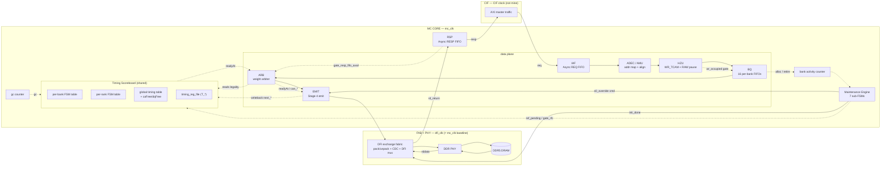

# MC-Core Architecture — top-level

**Phase 1, block 11 (the assembly).** How every block wires together. The packet-walk (03)
is the *flow*; this is the *structure* — blocks, shared state, ownership, clock domains,
and the two planes (data vs control/timing).

---

## 0. Full block diagram



**Two planes:** the **data plane** (solid) carries requests to DRAM and data back; the
**control/timing plane** (dashed) is the scoreboard, maintenance, and gating that decide
*when* each command is legal. The scheduler schedules commands; the fabric makes phases.

---

## 1. Clock domains

| Domain | Clock | Contains | Boundary |
|--------|-------|----------|----------|
| CIF | `cif_clk` | AXI slave (not mine) | — |
| **core** | `mc_clk` | IAF→ADEC→HZU→BQ→ARB→EMIT, scoreboard, ME, RSP | IAF (async), RSP (async) |
| back-end | `dfi_clk` | FAB, PHY | `dfi_clk == mc_clk` baseline → FAB CDC degenerate |

**Two async-FIFO seams, one real:** IAF (CIF→core) and RSP (core→CIF) are the genuine CDC
crossings; the FAB egress CDC collapses to a register stage at baseline (kept
parameterized for an async DFI clock). DRAM `tCK` is faster still, hidden PHY-side behind
the DFI gear ratio (1:1…1:4).

---

## 2. Data plane (request → DRAM → response)

```
WRITE: AXI ─IAF─▶ ADEC ─▶ HZU ─▶ BQ ─▶ ARB ─▶ EMIT ─▶ FAB ─▶ PHY ─▶ DRAM
                                                     └─ wr_launch (WR buffer) ─┘
       ack: commit ─▶ RSP ─▶ AXI

READ:  AXI ─IAF─▶ ADEC ─▶ HZU ─▶ BQ ─▶ ARB ─▶ EMIT ─▶ FAB ─▶ PHY ─▶ DRAM
       data: DRAM ─▶ PHY ─▶ FAB.rd (unpack) ─▶ RSP ─▶ AXI  (CIF reorders per id)
```

Requests arrive **formed** (CIF's job); the core carries `axi_id` through and returns it
tagged so CIF does AXI R/B ordering — the core never reorders.

---

## 3. Control / timing plane (the scoreboard + maintenance)

The **timing scoreboard** is the shared brain:

| Table | Written by | Read by |
|-------|-----------|---------|
| per-bank FSM (`state, row_open, next_cas/pre/act/ref`) | EMIT (Stage-4) + ME | ARB, EMIT |
| per-rank FSM (`next_*_any, faw_window, gate_rfc/zq, raa`) | ME | ARB, EMIT, ME |
| global timing (`next_*_bg, last_act_bg, caFree, dqFree`) | EMIT (Stage-4) | ARB, EMIT |
| `timing_reg_file` (`T_*`) | CSR (init) + ME MR_Write | all (combinational) |

- **Legality** is precomputed `can_*` flags (`(gc - next_x)[MSB]==0`) — ARB reads them +
  `readyAt`; **no subtractor in the pick path**.
- **`gc`** (global cycle counter) feeds the whole scoreboard.
- **HZU** gates BQ eviction via `wr_occupied` (RAW pause, no valid bit).
- **RSP** gates ARB read-issue via `gate_resp_fifo_avail` (reserved slot).

**Maintenance Engine** (peer, off the data plane): reads `bank_act_count`/`all_idle`/`raa`;
writes `ref_pending`/`gate_rfc` into the tables; injects its own commands through EMIT's
**Stage-0 override** (`ref_urgent > ref_due > rfm_req > zq_due`); owns `init_done` → the
FAB DFI mux (Init drives DFI at boot, scheduler after). Never issues a CAS.

---

## 4. Shared-state ownership

| State | Owner (writes) | Readers |
|-------|----------------|---------|
| per-bank / global timing tables | EMIT Stage-4 (+ ME sets `ref_pending`/gates) | ARB, EMIT |
| per-rank FSM table | ME | ARB, EMIT, ME |
| `timing_reg_file` | CSR init + ME MR_Write (verify→apply) | all |
| WR_TCAM / `wr_occupied` | HZU / watermark mgr | HZU (RAW), BQ evict gate |
| per-bank queues | watermark mgr (alloc/evict/retire) | ARB (head only) |
| bank activity counter | BQ alloc/retire | ME, power-mgmt |
| `gc` | free-running | all |
| `init_done` | ME (one-way latch) | FAB mux |

---

## 5. Config / sizing (validated)

| Param | Value | Basis |
|-------|-------|-------|
| `N_RD_ENTRIES` | 32 | OW-7 sweep (read floor; rd64 regresses) |
| `N_WR_ENTRIES` | 96 (3×) | OW-7 sweep (write depth = throughput lever) |
| `bankDepth` | 8 | OQ-20 |
| `tcam` (admission) | 32 | OQ-20 |
| in-flight | ≤128 | OQ-20 |
| arbiter | control 2/1/0, K=5000, guardrail ON, servo OFF, AGE_MAX=256 | OQ-20 |
| `N_RANKS` | 1→2 intent | cross-rank W→R dodges tWTR |
| gear ratio | 1:1…1:4 | DFI 5.2 |

All pkg values are **design intent** — pkg frozen until RTL-go.

---

## 6. Block index (this rebuild)

`00` ledger · `01` FAB · `02` EMIT+scoreboard · `03` packet-walk · `04` ADEC · `05` HZU ·
`06` ME · `07` BQ · `08` ARB · `09` IAF · `10` RSP · **`11` this (architecture)**.
Master spec PDF: `tex/rmc_mc_core_rebuild.pdf`.
