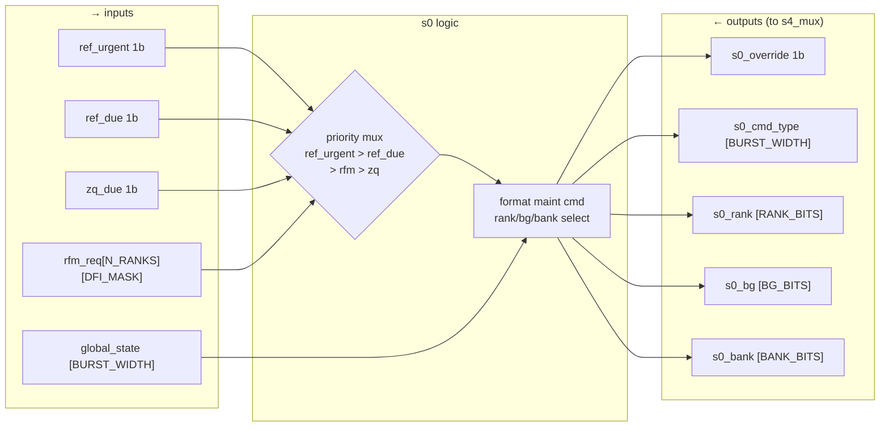
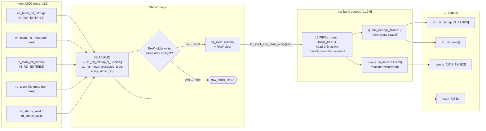
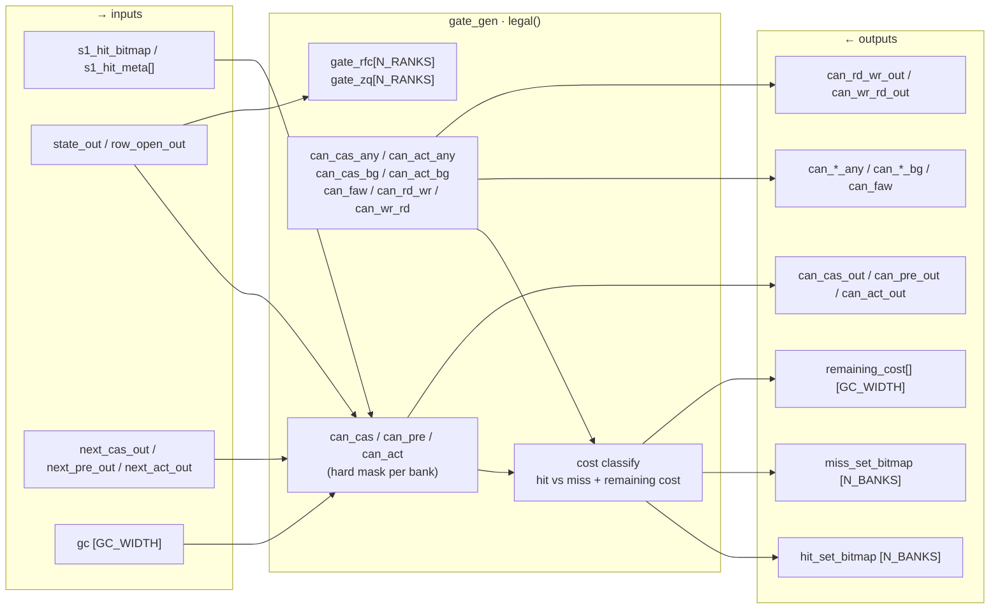
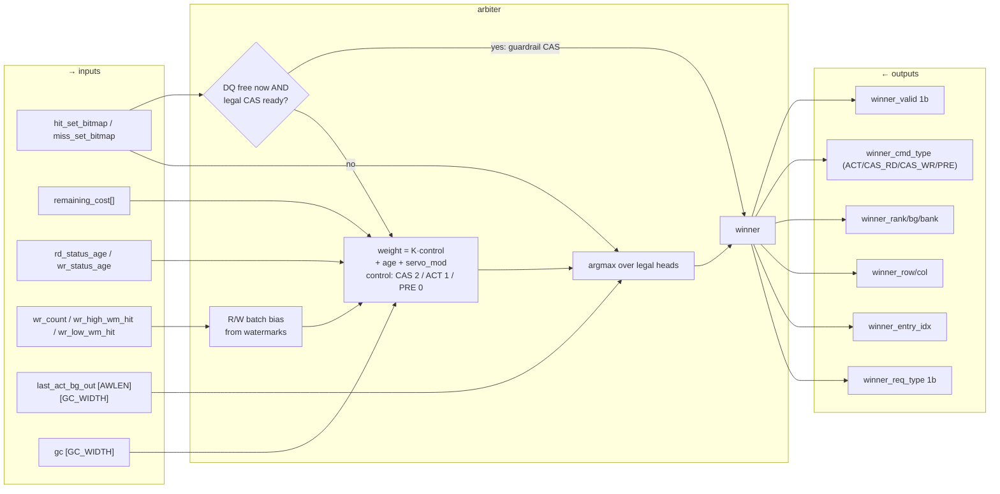
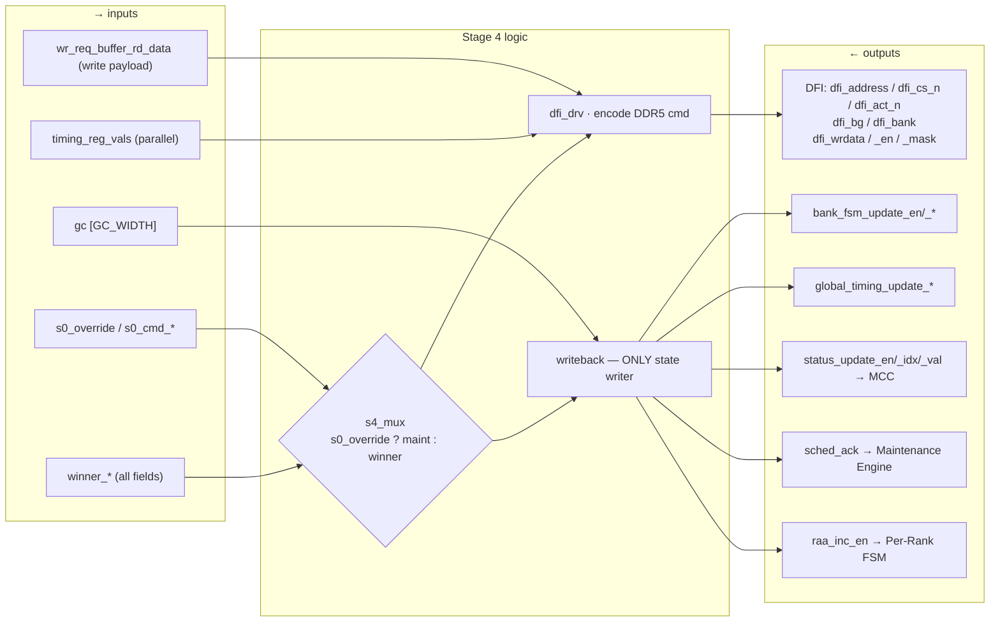

# RMC Scheduler — Per-Stage Detail Diagrams

Zoom views for [`scheduler_cmd_pipeline_diagram.md`](scheduler_cmd_pipeline_diagram.md).
One Mermaid block per stage (S0–S4), each expanded to net / gate level. Ports = frozen
`RMC_IO_Map.md §19`; `[v1.9.9]` = per-bank-queue / weight-arbiter rework nets. Golden
reference: [`../tools/sched_model/sched_test.js`](../tools/sched_model/sched_test.js).

Signal direction convention (matches the IO map): `→` an input the stage consumes,
`←` an output the stage drives.

---

## Stage 0 — Maintenance Override

Sits beside the pipe. Reaches DFI only through Stage-4's `s4_mux`. Pure priority select.

---

## Stage 1 — TCAM Search / Admission / Per-Bank Queues

ANDs TCAM hit with `VALID`, resolves RAW once, evicts classified entry into its per-bank
FIFO. Held reads raise `raw_block_en` (not evicted). Only the 16 heads leave the stage.

---

## Stage 2 — can_* Gate Check + Cost Classification

Hard-masks legality from precomputed timing (no subtractor in path), splits hit/miss sets,
tags each bank's remaining cost. Candidate set = the 16 `queue_head`s, not the flat bitmap.

---

## Stage 3 — Winner Select (weight arbiter [v1.9.9])

Guardrail first (never idle DQ), else `argmax(K·control + age + servo_mod)` over legal
heads. Watermarks bias R/W batch direction.

---

## Stage 4 — Command Emission + Writeback

Muxes maintenance vs winner, encodes DDR5 command onto DFI, runs the single writeback that
closes every feedback loop. The next clock edge feeds `timing_reg_file` back into Stage 2.

**Loop closure:** `W4a/W4b` write `timing_reg_file` → next clock edge → Stage 2 gates.
`W4c` writes req status back to MCC (`*_invalidate/update_status_schd_cmd`). Stage 0 gets
`sched_ack` only after its override actually emitted. No second command path exists.
