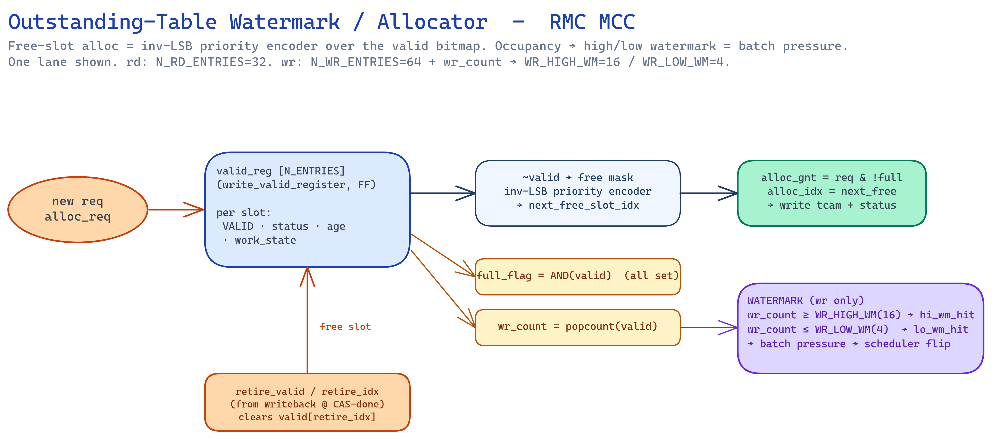

# RMC MCC — Short Notes (full deep dive)

Single-file technical reference for the **Reconfigurable DDR5 Memory Controller (RMC)** —
the whole MCC datapath from AXI ingress to the DDR5 PHY, with the **scheduler** as the
deep-wiring centrepiece (blocks 9–15, full internal connections).

Grounded in the RTL (`rmc/rtl/**/*.sv`, `rmc_pkg.sv`), the `RMC_IO_Map.md §19` ports, the
`mcc_v3.1` block sheet, and the golden model (`tools/sched_model/sched_test.js`).
Exhaustive port/net list: [`../docs/scheduler_wiring_spec.md`](../docs/scheduler_wiring_spec.md).

> **Phase:** doc-only, `rmc_pkg.sv` **frozen**. Widths are the frozen x16 instance
> (`N_BANKS=16`, `N_RD_ENTRIES=32`); intent is `N_BANKS=32` / `N_RD=64` (RTL phase).

---

## 0. Top-level dataflow

```
        AXI4                     CIF (async, credit)                MC CORE (DFI clk)                 DFI 5.2
 ┌───────────────┐   ┌──────────────────────────────┐   ┌───────────────────────────────────────┐  ┌─────┐
 │ axi_rd_port   │──►│ async_req_fifo ► burst_split  │──►│ AMU addr-map ► OUTSTANDING TABLES      │  │     │
 │ axi_wr_port   │   │ ► merge_logic  (CDC + credit) │   │ (tcam+status+watermark)  + WDB + RAW   │  │ PHY │
 │ (AXI4 slave)  │◄──│ async_resp_fifo ◄ ROB reorder │◄──│ ►► SCHEDULER ►► s4_mux ► dfi_drv ──────┼─►│ ►DDR│
 └───────────────┘   └──────────────────────────────┘   │ maintenance_engine (S0) ─┘  writeback  │  └─────┘
                                                         └───────────────────────────────────────┘
```

Reads and writes are **two parallel planes** end-to-end; they only meet at the scheduler's
`cand_gen` (batch-mode picks R or W per bank) and at the shared CA/DQ bus.

**Block map** (`rmc/rtl/`):

| group | modules |
|---|---|
| CIF | `axi_rd_port`, `axi_wr_port`, `async_req_fifo`, `async_resp_fifo`, `burst_splitter`, `merge_logic`, `amu`, `rob` |
| outstanding | `rd/wr_tcam`, `rd/wr_status_reg`, `rd/wr_watermark_mgr` |
| data / hazard | `wdb`, `raw_bypass_mgr`, `read_data_path`, `write_data_path` |
| scheduler | `scheduler` (classify→writeback), `timing_reg_file`, `gc_counter`, `bank_activity_ctr`, scoreboard (`bank_fsm_t`) |
| maintenance | `maintenance_engine` |
| support | `config_regs` (CSR), `error_handler`, `bank_partition_ctrl`, `hold_forward`, `merge_unit` |

Widths (frozen): `gc/next_*/age`=32, `row/lock_row`=17, `col`=10, `bg`=2, `bank`=2,
`dfi_cmd`=3, `N_BANKS`=16, `N_RD`=32, `N_WR`=64, nCK=16. `AGE_THR2=256` = row-lock cap.

Front-end block sheet: [`../mcc_v3.1.svg`](../mcc_v3.1.svg).

---

## 1. CIF — clock crossing + AXI ingress

- **`axi_rd_port` / `axi_wr_port`** — AXI4 slave. AR/R and AW/W/B channels; hand a compact
  request to the MCC via a **credit** interface (`req_valid`, `req_data`, `req_credit`).
  Writes also capture `wdata/wstrb` into the WDB.
- **`async_req_fifo` / `async_resp_fifo`** — the **CDC**. Credit-based
  (`wr_clk`=AXI, `rd_clk`=DFI); `rd_valid` registered. No Gray pointers exposed — credits
  bound occupancy across the domain crossing.
- **`burst_splitter`** — splits an AXI burst (`arlen/awlen`) into **DRAM-granular
  fragments** (one column access each). Credit `in_valid/out_valid`. Fragments of one
  burst become **siblings** — same bank/row demand the scheduler batches (row-hits).
- **`merge_logic`** — the return side: merges fragments back so the ROB/response sees a
  whole AXI burst.

---

## 2. Address map — `amu`

```
addr_in[32] ─► AMU ─► {ch, rank, bg[2], bank[2], row[17], col[10]}
   csr_ch_sel, csr_rank_shift  (CSR-programmable hash)
```

The **Address Mapping Unit** hashes the AXI address to DRAM coordinates. The **hash
choice is the single biggest knob for bank-level parallelism** — a good map spreads a
linear/strided stream across banks/BGs so the scheduler's `tFAW`/`tRRD` budget keeps up;
a bad one lands a stream in one bank and the scheduler collapses (the "one-bank" case).
Optimised offline by [`../tools/addrmap/`](../tools/addrmap). Also lowers rowhammer (RAA)
pressure by avoiding re-hammering one bank.

---

## 3. Outstanding tables + watermark / allocator



Each in-flight request owns a slot across three parallel structures: `*_tcam` (addr
search), `*_status_reg` (valid/status/age/`work_state`), and the WDB (write payload).
The **`*_watermark_mgr`** is the free-list allocator (the `inv_lsb_priority_encoder` over
`valid_field` in `mcc_v3.1`).

**Ports** (`wr_watermark_mgr`): `alloc_req→alloc_gnt/alloc_idx`, `retire_valid/retire_idx`,
`wr_count`. (rd side identical minus `wr_count`.)

**Logic:**
1. `valid_reg[N]` = occupancy bitmap (+ status/age/work_state per slot).
2. `free_mask = ~valid` → **inverse-LSB priority encoder** → `alloc_idx` (lowest free).
3. `full_flag = &valid`; `alloc_gnt = alloc_req & !full_flag` (back-pressures CIF).
4. On grant: set `valid[idx]`, same cycle write `tcam[idx]={bg,bank}`, `status[idx]=
   {age=gc, work_state}`, and (writes) payload → `wdb[idx]`.
5. On `retire_valid` (from writeback @ CAS-done): clear `valid[retire_idx]`.
6. `wr_count = popcount(valid)`; **watermarks** (writes): `≥WR_HIGH_WM(16)`→`hi_wm_hit`,
   `≤WR_LOW_WM(4)`→`lo_wm_hit` → the scheduler's **batch-flip** pressure.

Depth bounds outstanding parallelism — 64 reads hides a 126-tCK row-miss (§6.5).

---

## 4. Data buffers + RAW hazard

- **`wdb`** (write data buffer) — SRAM `WR_BUF_DEPTH` deep. `wr_idx/wr_data/wr_en` in from
  AXI; `rd_idx→rd_data` out to `write_data_path` at the write CAS (WL ahead).
- **`rob`** (reorder buffer) — `alloc_axi_id→alloc_seqnum`, `retire_seqnum`. Restores AXI
  ordering for out-of-order completions before the response FIFO.
- **`raw_bypass_mgr`** — read-after-write hazard. Inputs `wr_match[N_WR]` (exact-addr
  match bitmap), `wr_age[]`, `rd_age`; outputs `raw_hit`, `raw_wr_idx` = the **newest
  older** write to forward. This is the `RAW_hit / RAW_fetch / RAW_write` stage chain in
  `mcc_v3.1` — a read that hits an in-flight write is served from the WDB, not DRAM.
- **`read_data_path`** — `dfi_rddata→rd_data_out`; `mrr_sideband` for mode-register reads.
- **`write_data_path`** — `wdb_rd_data→dfi_wrdata/dfi_wrdata_en` (driven WL ahead of CAS).

---

## 5. Maintenance engine (S0 triggers)

```
maintenance_engine:  init_done ─► {ref_urgent, ref_due, rfm_req, zq_due} ─► scheduler S0
                     sched_ack ◄─ scheduler       dfi_mux_valid/cmd ─► DFI (maintenance path)
```

Owns the four maintenance sub-FSMs — **refresh** (leaky-bucket credits, REFab/REFsb/skip
predictor), **RFM** (rowhammer, RAA≥RAAIMT), **ZQcal**, **power-down/self-refresh**. It
raises the trigger signals the scheduler's S0 layer consumes and, when granted
(`sched_ack`), drives its own DFI mux command. Full logic:
[`../docs/scheduler_staged_logic.md`](../docs/scheduler_staged_logic.md) §Stage 0.

---

## 6. SCHEDULER (the core)

The scheduler is `N_BANKS` **per-bank paths** feeding one arbiter. Named by class (S1
PRE / S2 ACT / S3 CAS) for the timing story, but the hardware is: **registered scoreboard
→ combinational gates → arbiter → writeback**, all in one 1-cmd/2-tCK loop.

> **Deepest dive — algorithm + full internal wiring:** [`scheduler_deep.md`](scheduler_deep.md)
> (exact `legal()`/`emit()`/loop pseudocode from the golden model, timing table, worked
> trace). The summary below is the map; that file is the spec.

### 6.0 Internal wiring — one cycle, end to end

```
 gc, scoreboard.next_*/row_open ─► gate_gen ─► can_cas/act/pre[N_BANKS]
 tcam.match, status.valid/age, row_open ─► classify ─► work_state, s1_hit_meta
 classify + can_* ─► cand_gen ─► candidate[b]{cmd,idx,bank,bg,row,col,R/W}
 candidate[], can_*[], age[lane], servo(popcount can_cas, dqFree−gc, tFAW) ─► arbiter ─► winner
 winner, s0_override ─► s4_mux ─► final_cmd
 final_cmd ─► dfi_drv ─► dfi_cmd_valid/cmd/addr/bank/bg
 final_cmd ─► writeback ─► { scoreboard.next_* & row_open & state,
                             status.work_state advance / retire,
                             watermark.retire, maint.raa_inc / ref_credits }
                             └──────► (next clock edge) scoreboard ► gates ...   [the loop]
```

Exhaustive net list with widths + Visio placement:
[`../docs/scheduler_wiring_spec.md`](../docs/scheduler_wiring_spec.md).

### 6.1 Block 9 — `classify` (TCAM-vec → hit/empty/miss)

The **TCAM keys `{bg,bank}` only** (`rd_tcam.sv`: `s_bg,s_bank→match[N]`) — it finds
same-bank entries, not row. Row-hit is a second 17b compare against the scoreboard:

```
same_bank = tcam.match[e]
bank_open = (state[b]==BANK_ACTIVE)
row_hit   = bank_open & (entry.row == row_open[b])

classify → NEED_CAS (hit)  | NEED_ACT (empty, !bank_open) | NEED_PRE (miss, open & !row_hit)
```

Writes the 2-bit `work_state`; emits `s1_hit_bitmap` (valid-gated) + `s1_hit_meta[]`.
**Ping-pong:** 64-deep buffer, 32-wide TCAM → two 32-halves scanned alternately,
`work_state` registered; the unscanned half is 1 cycle stale — harmless (`tRCD ≫ 1`).

### 6.2 Block 10 — `gate_gen` (comparators + AND → `can_*`)


`can_*` is a **comparator output over registered `next_*` counters**, re-evaluated every
cycle — not a static wire.

```
can_cas[b] = row_open & (open_row==R) & gc≥next_cas & gc≥next_cas_bg(tCCD_L)
             & gc≥next_cas_any(tCCD_S) & gc≥dqFree & turnaround & !age_cap
can_act[b] = !row_open & gc≥next_act(tRP) & gc≥tRRD_L/S & tFAW_ring<4 & !gate_rfc
can_pre[b] = (demand_count==0 | oldest_miss_age≥AGE_MAX) & gc≥next_pre(tRAS,tRTP,tWR)
```

**Row-lock** lives in `can_pre`: a bank holds its open row until `demand==0` or age-cap.
Cap is **two-sided** — it also gates that bank's CAS so the burst finishes and `tRTP/tWR`
clears, else the PRE stays timing-blocked (golden-model finding).

### 6.3 Block 11 — `cand_gen` (per-bank head)

Each bank emits **one** candidate `{cmd_type, entry_idx, bank, bg, row, col, req_type}`.
The row-lock serializes intra-bank (locked→its hit, releasable→PRE, idle+demand→ACT).
Each path spans rd+wr; `batch_policy_reg` picks the R or W head — the only rd/wr merge.
Cross-bank timing (`tCCD_L/tRRD_L/tFAW`) is **not** here; it applies at the arbiter.

### 6.4 Block 12 — `arbiter` (weight + aging + servo)


**Weight = control (SJF, fixed: CAS>ACT>PRE, REF override) + aging (per lane).** Aging
`+1` every waiting cycle, `=0` on win → bounded starvation. Pick
`argmax(K·control + age)`; ties → oldest age, then BG-rotate.

**⚠ K-scaling:** aging every cycle would swamp the fixed control weight → arbiter
degenerates to oldest-first (loses CAS-first). `K` keeps SJF governing until real
starvation. Weights-pass knob.

**DQ-occupancy servo (CAS↔ACT balance):**
```
ready_cas = popcount(can_cas)     dq_free_in = dqFree − gc
pool thin & DQ freeing → boost ACT weight     pool deep / tFAW tight → damp ACT
GUARDRAIL: dq_free_in==0 & ready_cas≥1 ⇒ CAS wins absolutely   (never idle DQ)
```

### 6.5 Latency chains (b4800 tCK) — the sizing driver

| case | chain | first data |
|---|---|---|
| row-hit (best) | `CAS` | RL = 40 |
| row-empty | `ACT→CAS` | 39+40 = 79 |
| **row-miss (worst)** | `PRE→ACT→CAS` | 39+39+40 = **118** (+8 = 126) |
| + refresh | `…REF…→PRE→ACT→CAS` | + tRFC 708 |
| write tail → PRE | `CAS_WR→…→PRE` | WL+BL2+tWR = 118 |

`L_miss=126`, service = BL/2 = 8 → floor `N=126/8≈16` in-flight reads; depth 64 = margin.

### 6.6 Block 13 — `s4_mux` (winner vs override)

```
final = s0_override ? s0_cmd : winner
priority: REF(override,crit) > CAS(busy-fill) > ACT/PRE(prep) > REF(due,non-crit)
```
**CA:DQ budget:** BL16 CAS = 8 tCK DQ = 4 CA slots; CAS uses 1, the other **3 carry
prep** (ACT/PRE for other banks) in the burst shadow. Never `N_BANKS` cmds/cycle.

### 6.7 Block 14 — `dfi_drv` (DFI 5.2)

| cmd | pins | extra |
|---|---|---|
| ACT | act_n=L | row |
| RD/WR | cas=L, we=H/L | col; `dfi_*data_en` ahead by RL/WL |
| PRE | ras=L, we=L | AP `addr[10]` |
| REFab/sb | ras=L, cas=L, we=H | REFsb: `dfi_bank`=index |

Top-out: `dfi_cmd_valid, dfi_cmd[3], dfi_addr_row[17], dfi_addr_col[10], dfi_bank[2], dfi_bg[2]`.

### 6.8 Block 15 — `writeback` (commit + feedback = the gate)

```
scoreboard: on ACT next_cas=gc+tRCD, next_pre=gc+tRAS, row_open=new, state=ACTIVE
            on CAS dqFree=gc+lat+BL2, next_cas_bg=gc+tCCD_L, next_cas_any=gc+tCCD_S,
                   next_pre = MAX(next_pre, gc+tRTP | gc+WL+BL2+tWR)   ← the MAX bug
            on PRE next_act=gc+tRP, state=IDLE
status:    work_state NEED_PRE→ACT→CAS→DONE ; retire on CAS-done
watermark: retire_valid/idx → free slot          maint: raa_inc, ref_credits, sched_ack
data:      rd→ROB @ RL ; wr←WDB @ WL
```

Issue CAS → `dqFree`/`next_cas_*` jump → next cycle `can_cas` deasserts for the burst
window → 3 CA slots free → prep other banks → their CAS legal when DQ frees → **DQ full**.
`next_pre = MAX` (not overwrite) is the golden-model-caught bug the RTL must replicate.

---

## 7. Deep technical points (gotchas)

- **`next_pre = MAX`** over its writers, not overwrite (§6.8).
- **Two-sided force-break** on the age cap — also gate CAS so tRTP/tWR clears (§6.2).
- **Ping-pong 1-cycle staleness** harmless: `tRCD ≫ 1` (§6.1).
- **CA:DQ = 1 cmd / 2 tCK; BL16 = 4 CA slots** — prep rides the shadow (§6.6).
- **tFAW ceiling** = 4 ACT / 32 tCK ≈ burst bandwidth — collapses on one-bank streams.
- **TCAM keys {bg,bank} only** — row-hit is a separate compare (§6.1).
- **Servo guardrail** dominates weights: DQ-free + ready ⇒ CAS wins (§6.4).
- **Aging needs K** or oldest-first degeneration (§6.4).
- **Address map** is the top parallelism knob (§2); one-bank landing kills throughput.
- **RAW bypass** serves read-from-WDB, never round-trips DRAM (§4).
- **`AGE_THR2=256`** (pkg) = the `AGE_MAX` cap.

---

## 8. Weights pass (open, deferred)

Tune as **one sweep** vs the golden model — they interact: `K`, control-weight values,
`AGE_MAX`, `POOL_LOW/POOL_HIGH/LOOKAHEAD` (servo). The golden model currently uses
busy-first + oldest tie-break; adding the explicit aging counter + servo to it keeps it
the RTL reference.

## 9. Map

| topic | file |
|---|---|
| **scheduler deep dive (algorithm + wiring)** | [`scheduler_deep.md`](scheduler_deep.md) |
| front-end block sheet | [`../mcc_v3.1.svg`](../mcc_v3.1.svg) |
| watermark / allocator | `diagrams/watermark_logic.png` |
| FSM + arbiter | `diagrams/bank_fsm.png` · [`../docs/scheduler_bank_fsm.md`](../docs/scheduler_bank_fsm.md) |
| gate datapath + servo | `diagrams/sched_gate_hw.png` |
| full port/net list + placement | [`../docs/scheduler_wiring_spec.md`](../docs/scheduler_wiring_spec.md) |
| stage/port view | [`../docs/scheduler_staged_logic.md`](../docs/scheduler_staged_logic.md) |
| golden model | [`../tools/sched_model/sched_test.js`](../tools/sched_model/sched_test.js) |
