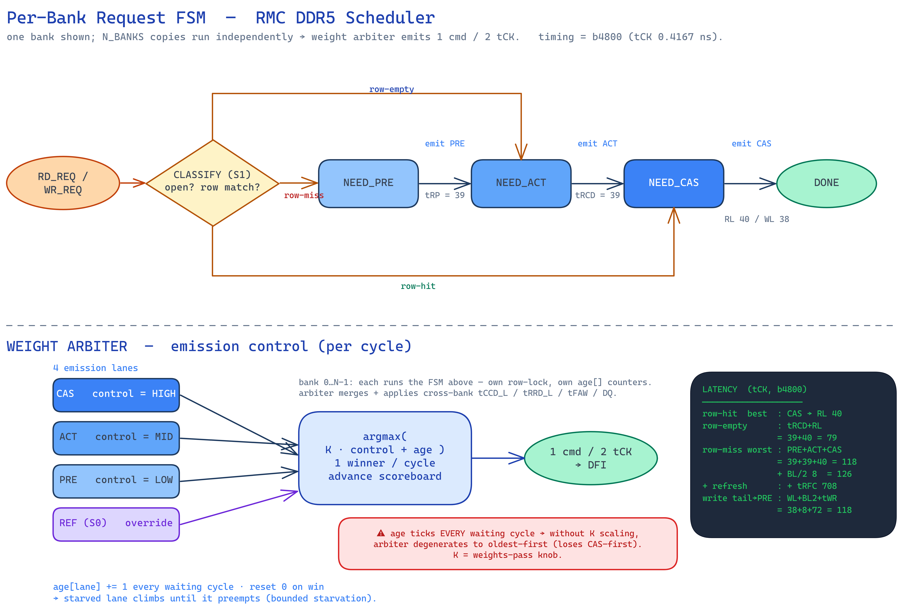
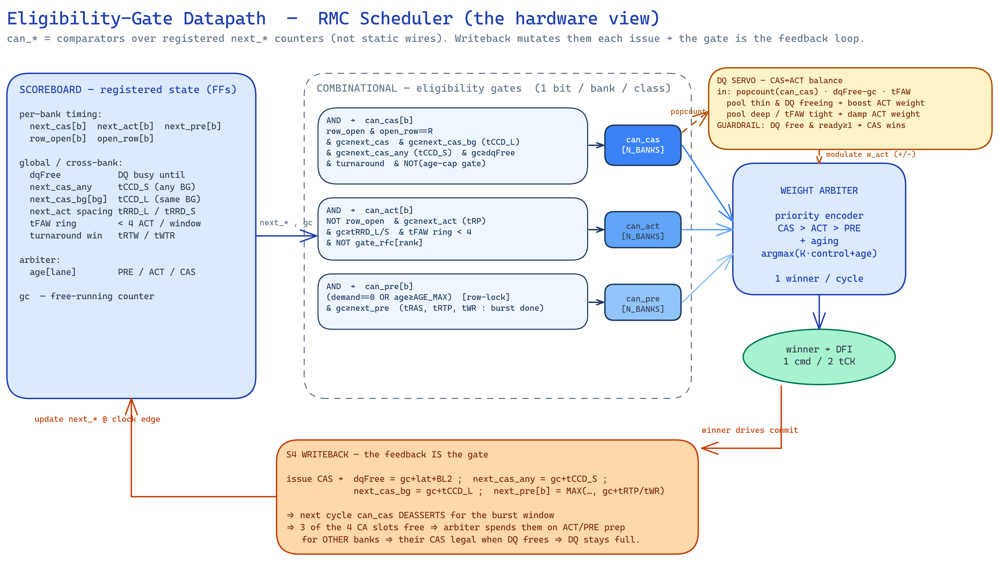

# RMC Scheduler — Deep Down (algorithm + full internal wiring)

The exhaustive scheduler spec: every register, every gate term, the exact per-cycle
algorithm, and the internal connections between blocks 9–15. The golden model
[`../tools/sched_model/sched_test.js`](../tools/sched_model/sched_test.js) **is** the
cycle-accurate reference — the pseudocode below is that model, named to the RTL. The
eventual RTL must match it cycle-for-cycle on the same trace.

Timing = `b4800` bin (DDR5-4800B, tCK 0.4167 ns). Companion:
[`README.md`](README.md) (full MCC), [`../docs/scheduler_wiring_spec.md`](../docs/scheduler_wiring_spec.md)
(port/net list + Visio placement), [`../docs/scheduler_queue_arch.md`](../docs/scheduler_queue_arch.md)
(post-mentor residency split — the candidate set in §5.1).

---

## 1. Scoreboard — the registered state

Everything the scheduler decides from. All flip-flops, updated at `emit`/writeback
(§4). RTL name ↔ model field:

**Per bank** `b` (the `bank_fsm_t` row):
| RTL | model | meaning | set by |
|---|---|---|---|
| `row_open`, `open_row` | `b.open`, `b.row` | is a row open, which | ACT / PRE |
| `next_cas` | `b.nCas` | earliest legal CAS gc (tRCD after ACT) | ACT |
| `next_pre` | `b.nPre` | earliest legal PRE gc (**MAX** of tRAS / tRTP / tWR) | ACT, CAS |
| `next_act` | `b.nAct` | earliest legal ACT gc (tRP after PRE / tRFC after REF) | PRE, REF |
| `oldest_miss_age` | `b.lockAge` | row-lock age (hot-row starvation counter) | loop §4 |
| `state` | — | `BANK_IDLE/ACTIVATING/ACTIVE/PRECHARGING/…` | all |

**Per bank-group** `bg`: `next_cas_bg` (`g.nCasBg`, tCCD_L), `next_act_bg` (`g.nActBg`, tRRD_L).
**Per rank**: `next_act_any` (`rk.nActAny`, tRRD_S), `faw[]` ring (tFAW, 4-deep),
`nRdWr` (tRTW window), `nWrRd` (tWTR+WL+BL2 window).
**Global** `G`: `next_cas_any` (`G.nCasAny`, tCCD_S), `dqFree` (DQ busy-until),
`caFree` (**CA bus free**, = 1 cmd / 2 tCK), `nPreAny` (tPPD), `lastCasBg` (BG-rotate).
**Demand**: `demand[rank][bank][row]` = count of pending requests to that exact row
(row-hit demand; the row-lock hold condition).
**Arbiter (design upgrade, §6)**: `age[lane]` per emission lane.

---

## 2. Command legality — `legal(t, cmd, gc)` → the `can_*` gates

The hard eligibility test. Every term is a `gc ≥ next_*` comparison over the registered
state (§1). This is exactly block 10 (`gate_gen`).

```
# CA bus — 1 command per 2 tCK (global, all classes)
if gc < caFree:              return NOT-LEGAL

# ---- ACT (can_act) ----
if cmd == ACT:
    return !row_open
         & gc >= next_act            # tRP since PRE  (or tRFC since REF)
         & gc >= next_act_bg          # tRRD_L  same BG
         & gc >= next_act_any         # tRRD_S  any BG
         & fawOk                      # < 4 ACT within tFAW (rank ring)

# ---- PRE (can_pre) ----  — carries the row-lock
if cmd == PRE:
    if !row_open | gc < next_pre | gc < nPreAny:   return NOT-LEGAL   # tRAS/tRTP/tWR, tPPD
    dem = demand[rank][bank][open_row]
    if dem == 0:            return LEGAL            # lock released — all hits drained
    return oldest_miss_age >= AGE_MAX               # hot-row hammer — force-break only

# ---- CAS (can_cas) ----
# two-sided force-break: if this bank's lock aged out, STOP serving its hits so the
# burst finishes, tRTP/tWR clears, and the starved miss's PRE can force-break in.
if lock_on & oldest_miss_age >= AGE_MAX:            return NOT-LEGAL
l = (dir==R ? RL : WL)
return row_open & (open_row == req_row)             # right row open
     & gc >= next_cas                               # tRCD since ACT
     & gc >= next_cas_bg                            # tCCD_L same BG
     & gc >= next_cas_any                           # tCCD_S any BG
     & (gc + l) >= dqFree                           # DQ bus free when data lands
     & (dir==R ? gc >= nWrRd : gc >= nRdWr)         # turnaround (W→R : R→W)
```

`fawOk = (faw.length < 3) OR (gc − faw[len−3] >= tFAW)` — the 4th ACT must be tFAW
after the 1st in the window.

---

## 3. Timing constants applied (b4800, tCK)

| constraint | nCK | where enforced (legal/emit) |
|---|---|---|
| tRCD ACT→CAS | 39 | `next_cas = ACT + 39` |
| tRP PRE→ACT | 39 | `next_act = PRE + 39` |
| tRAS ACT→PRE | 77 | `next_pre = ACT + 77` |
| RL / WL | 40 / 38 | data lands at CAS + RL/WL; `dqFree = CAS + l + 8` |
| tRTP RD→PRE | 18 | `next_pre = MAX(., RD + 18)` |
| tWR (WR→PRE tail) | 72 | `next_pre = MAX(., WR + WL+8+72)` |
| tCCD_S / tCCD_L | 8 / 12 | `next_cas_any` / `next_cas_bg` (rd); `tCCD_L_WR=32` wr |
| tWTR_L (W→R) | 24 | `nWrRd = WR + WL+8+24` |
| tRTW (R→W) | 12 | `nRdWr = RD + RL+8−WL+2` |
| tRRD_S / tRRD_L | 8 / 12 | `next_act_any` / `next_act_bg` |
| tFAW | 32 | 4-ACT ring |
| tPPD PRE→PRE | 2 | `nPreAny` |
| BL2 (burst on DQ) | 8 | `dqFree`, DQ-collision |
| tRFC / tRFCsb | 708 / 312 | refresh drain |

The independent checker (`cons()`/`validate()`) re-derives all of these from the emitted
stream — the scheduler and the checker never share code, so an illegal emit is caught.

---

## 4. Commit — `emit(t, cmd, gc)` → writeback (block 15)

The **only** state mutation. `caFree = gc + 2` always (consumes the CA slot). Then:

```
ACT:  row_open=1 ; open_row=req_row ; oldest_miss_age=0          # acquire lock
      next_cas = gc + tRCD ; next_pre = gc + tRAS
      next_act_bg = gc + tRRD_L ; next_act_any = gc + tRRD_S ; faw.push(gc)

PRE:  row_open=0 ; oldest_miss_age=0
      next_act = gc + tRP ; nPreAny = gc + tPPD

CAS:  l = (dir==R ? RL : WL)
      next_cas_bg = gc + (dir==R ? tCCD_L : tCCD_L_WR) ; next_cas_any = gc + tCCD_S
      dqFree = gc + l + BL2 ; lastCasBg = bg
      if R:  next_pre = MAX(next_pre, gc + tRTP)        ; nRdWr = gc + tRTW
      if W:  next_pre = MAX(next_pre, gc + WL+BL2+tWR)  ; nWrRd = gc + WL+BL2+tWTR_L
      retire: done=1 ; activeCount-- ; demand[.][.][row]--
```

**`next_pre = MAX(next_pre, …)`** — not overwrite. ACT sets tRAS; a later CAS raises it to
tRTP/tWR. Taking the wrong one lets a PRE fire before the burst recovers — a real bug the
golden model caught; **RTL must replicate the MAX**. This is the feedback that makes
`can_cas` deassert for the burst window (`dqFree`, `next_cas_*` jump forward).

---

## 5. The per-cycle algorithm (greedy) — the arbiter loop

```
while (work remains):
  if gc < caFree:  gc = caFree ; continue          # CA bus busy (2-tCK cmd)

  # --- refresh superstate (S0 override) ---
  if gc >= nextRef:  enter REF: drain open banks → PREA (@ maxPre) → wait tRP → REF → banks nAct=gc+tRFC

  # --- candidate set (§5.1): window OR queue-arch admission+per-bank heads ---
  vis = first WIN non-done entries by age           # WIN=64 realistic; queueArch → bank heads

  # --- ping-pong classify: refresh one 32-half by (gc & 1); wstate registered ---
  for e in vis: if e's half is live this cycle: e.wstate = liveCmd(e)

  # --- scan vis, classify, collect one best per class ---
  cas=null (busy-first) ; act=null ; pre=null ; oppCas=false
  for t in vis:
      c = nextCmd(t)                                # NEED_CAS / NEED_ACT / NEED_PRE
      if c==PRE and demand[t.row]>0:  missWait[bank]=true      # a miss is waiting behind hits
      if !legal(t,c,gc):  continue
      if c==CAS:  if batch and t.dir!=mode: oppCas=true; continue      # wrong batch dir — skip
                  score = (t.bg==lastCasBg ? 1e9 : 0) + t.id           # BG-rotate, then oldest
                  keep min-score  → cas
      if c==ACT:  keep oldest id  → act
      if c==PRE:  keep oldest id  → pre

  # --- row-lock aging: an open bank still owing demand while a miss waits ages toward cap ---
  for each bank b: if b.open & missWait[b] & demand[b.row]>0:  b.lockAge++  else  b.lockAge=0

  # --- emit priority: CAS > ACT > PRE  (busy-first keeps DQ full) ---
  if cas:  emit(cas,CAS)   elif act:  emit(act,ACT)   elif pre:  emit(pre,PRE)
  else:    stall++ ; if stall >= tRAS+tRP and opposite work exists: flip batch ; else gc++

  # --- adaptive batch: charge gate-loss for a skipped opposite CAS on a free DQ ---
  if oppCas and !cas and gc>=dqFree:  gateLoss += 2
  if gateLoss >= BL2 and opposite work exists:  flip batch (mode R↔W)
```

`nextCmd(t) = pingpong ? t.wstate : liveCmd(t)`;
`liveCmd(t) = open & row==t.row ? CAS : open ? PRE : ACT`.
`mode` = current batch direction (R/W); `flip` toggles it, resets gateLoss/stall.

**Why busy-first + BG-rotate:** CAS keeps DQ full; among legal CAS, prefer a **different
BG** than the last (`tCCD_S=8 < tCCD_L=12`), then the oldest. ACT/PRE only win a cycle
when no CAS is legal — they ride the 3 free CA slots in the burst shadow.

---

## 5.1 Candidate set — window vs queue-arch (admission + per-bank queues)

Only the **candidate set** feeding the §5 scan differs; `legal()`/`emit()`/arbiter are
byte-identical either way. Two models, both in the golden model (`opts.queueArch`):

**Window model (baseline).** One flat buffer; `vis` = first `WIN=64` non-done entries by
age. The picker sees up to 64 entries across all banks. This is the old single-residency
view — a request stays searchable its whole life.

**Queue-arch (post-mentor).** Split residency — see
[`../docs/scheduler_queue_arch.md`](../docs/scheduler_queue_arch.md):

```
source (arrival order)
   │  admit in order, up to TCAM_SIZE (32) slots
   ▼
TCAM  = classify station (SHORT residency)
   │    classify {bg,bank}→bank, row vs open_row→hit/miss, RAW full-addr compare
   │    EVICT when bank queue has room AND RAW clear      ← frees the TCAM slot
   ▼
per-bank FIFO ×N_BANKS  (bankDepth 8)   in-flight home
   │    HEAD only is active (a bank decodes one command at a time)
   ▼
vis = { head of each non-empty bank queue }   → §5 scan (≤ N_BANKS candidates)
```

Rules the model enforces:
- **admit** in arrival order until TCAM full (`TCAM_SIZE`);
- **evict** a classified entry to `bq[rank][bank]` when it has room (`< bankDepth`) and
  RAW is clear; else it **stays in TCAM** → backpressure (TCAM-full stalls admission);
- **head-only**: `vis` collects `bq[r][b][0]` per bank — one active request per bank; when
  its CAS emits (`done`), the queue pops and exposes the next head next cycle;
- **RAW pause**: a read with an **older, not-yet-emitted write to the same address** in
  TCAM or its bank queue is held in TCAM (not evicted) until the write drains — no bypass,
  no reorder. Model proxy = `{rank,bank,row}` (no column), conservative.

**Where the §1 scoreboard state now lives:** timers (`next_*`) stay **per-bank** (a bank
property — the head reads them); command-progress `state` (`NEED_PRE/ACT/CAS`) rides in
the **queue entry**; `valid`/occupancy → **queue depth counters** (the relocated
watermark). Nothing in §2/§4 changes — the gates read the same `next_*`.

**Result (measured):** 0 violations / 0 unscheduled both bins; DQ-busy within **±2pt** of
the window model (per-bank head visibility is competitive); drains at `tcam=8,
bankDepth=2`; RAW keeps RD after its WR. Unified per-bank FIFO already program-orders
same-bank, so `rawPause` is the guard reserved for the **split-R/W-queue** variant — that
split + exact depth = the deferred sweep (§6, [`../docs/scheduler_queue_arch.md`](../docs/scheduler_queue_arch.md) §6).

---

## 6. The weight-arbiter upgrade (design; not yet in the model)

The model above uses **busy-first + oldest tie-break**. The design refinement replaces the
fixed CAS>ACT>PRE ordering with an explicit **weight** so starvation and DQ-balance are
tunable:

```
weight(lane) = K · control[lane] + age[lane] + (lane==ACT ? servo_mod : 0)
   control : CAS > ACT > PRE  (SJF, fixed)          age : +1 per waiting cycle, 0 on win
   servo_mod (DQ balance):  ready_cas=popcount(can_cas) ; dq_free_in=dqFree−gc
        pool thin  & DQ freeing → +boost ACT        pool deep / tFAW tight → −damp ACT
   GUARDRAIL: dq_free_in==0 & ready_cas≥1  ⇒ CAS wins absolutely   (never idle DQ)
winner = argmax weight over legal candidates ; ties → oldest age → BG-rotate
```

`K` scales control vs age so SJF governs normal waits and aging only breaks real
starvation (else it degenerates to oldest-first). `K`, control values, `AGE_MAX`,
`POOL_LOW/HIGH/LOOKAHEAD` = one **weights pass** vs the golden model.
See [`../docs/scheduler_bank_fsm.md`](../docs/scheduler_bank_fsm.md) §4.



---

## 7. Internal wiring — model function ↔ RTL block ↔ nets



| model | block (§README 6) | consumes | produces |
|---|---|---|---|
| `liveCmd`/`nextCmd`, vis, ping-pong / **admit+evict** (queueArch) | **9 classify / admission** | `tcam.match`, `status.valid/age`, `row_open`, `open_row`, RAW compare | `work_state`, `s1_hit_meta`, vis (window OR bank-queue heads §5.1) |
| `bq[rank][bank]`, head-only, backpressure | **9b per-bank queues** | evicted classified entries, `bankDepth`, `done` | `queue_head[b]`, `queue_full[b]` (relocated watermark) |
| `legal()` terms | **10 gate_gen** | `next_cas/act/pre`, `dqFree`, `next_cas_bg/any`, `faw`, turnaround, `demand`, `lockAge` | `can_cas/act/pre[N_BANKS]` |
| per-`t` classify + head | **11 cand_gen** | `work_state` + `can_*` + `batch_policy` | `candidate[b]{cmd,idx,bank,bg,row,col,R/W}` |
| scan/score/lockAge/gateLoss | **12 arbiter** | `candidate[]`, `can_*[]`, `age[]`, servo(`popcount can_cas`,`dqFree−gc`) | `winner` |
| `caFree`, refresh, `s0_override` | **13 s4_mux** | `winner`, `s0_*` | `final_cmd` |
| DFI encode | **14 dfi_drv** | `final_cmd` | `dfi_cmd_valid/cmd/addr/bank/bg` |
| `emit()` | **15 writeback** | `final_cmd`, `timing_rf` | scoreboard `next_*/row_open/state`, `status` advance/retire, `watermark.retire`, `raa_inc`, `ref_credits` |

The loop closes: writeback → scoreboard (next clock edge) → gate_gen → arbiter → writeback.
Exhaustive net list with widths + placement:
[`../docs/scheduler_wiring_spec.md`](../docs/scheduler_wiring_spec.md).

---

## 8. Worked micro-trace (row-miss, one bank, b4800)

Request wants `bank5/rowB`, `bank5` has `rowA` open, 2 pending hits to `rowA` first:

```
gc      cmd          scoreboard effect                              DQ
────────────────────────────────────────────────────────────────────
t0      CAS_RD rowA   demand[rowA]-- ; dqFree=t0+48 ; nPre=MAX(.,t0+18)   [t0+40 .. t0+48]
t0+8    CAS_RD rowA   demand[rowA]==0 → lock releases ; nPre=MAX(.,t0+26) [t0+48 .. t0+56]
t0+26   PRE  (rowA)   row_open=0 ; nAct=t0+65                              —
t0+65   ACT  (rowB)   row_open=1,row=B ; nCas=t0+104 ; nPre=t0+142         —
t0+104  CAS_RD rowB   data @ t0+144                                        [t0+144..]
```

The miss's PRE waits on **both** `next_pre` (tRTP after the last hit CAS) **and** the lock
(demand drained). If the hits never stopped, `oldest_miss_age` would hit `AGE_MAX=256` and
force-break (two-sided: hits gated too, so tRTP clears). Meanwhile other banks' CAS fill
the DQ gaps t0+56 … t0+144 — that is where throughput comes from.

---

## 9. Deep points

- **`caFree`** is the 1-cmd/2-tCK CA budget — the first check every cycle.
- **`next_pre = MAX`**, never overwrite (§4). Golden-model-caught.
- **Two-sided age-cap**: `legal(CAS)` also fails when `lockAge≥AGE_MAX` so the burst
  finishes and the PRE unblocks (§2).
- **BG-rotate score** `(bg==lastCasBg?1e9:0)+id` — prefer a different BG, then oldest.
- **Batch gate-loss**: skipping an opposite-dir CAS on a free DQ charges `gateLoss`; flip
  at `≥BL2`. Stall-flip at `≥tRAS+tRP`.
- **Window `WIN=64`** is the realistic visibility (~43% busy on ACT-bound interleave);
  `∞` inflates to ~73% by batching the whole trace.
- **tFAW** caps ACT at 4 / 32 tCK ≈ burst bandwidth — the hard prep ceiling.
- **`AGE_THR2=256`** (pkg) = `AGE_MAX`.
- **Queue-arch candidate set** (§5.1): TCAM = short classify station, per-bank FIFOs hold
  in-flight, pickers see heads only. Same gates/writeback; ±2pt busy. TCAM is **not
  removed** — still the classify/RAW engine, residency shortened.

## 10. Map

| | |
|---|---|
| algorithm (authoritative) | [`../tools/sched_model/sched_test.js`](../tools/sched_model/sched_test.js) |
| full MCC | [`README.md`](README.md) |
| behaviour (FSM + arbiter) | [`../docs/scheduler_bank_fsm.md`](../docs/scheduler_bank_fsm.md) |
| residency (admission + queues) | [`../docs/scheduler_queue_arch.md`](../docs/scheduler_queue_arch.md) |
| ports/nets/placement | [`../docs/scheduler_wiring_spec.md`](../docs/scheduler_wiring_spec.md) |
| stage/port view | [`../docs/scheduler_staged_logic.md`](../docs/scheduler_staged_logic.md) |
